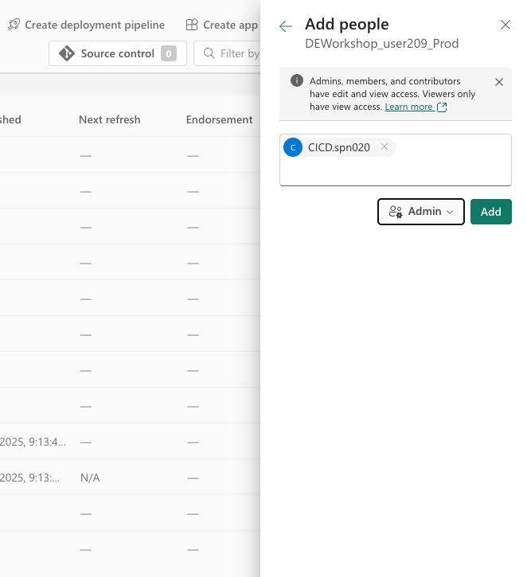
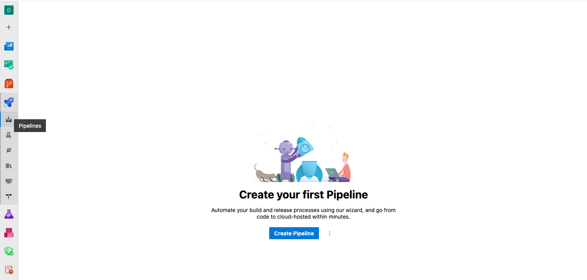
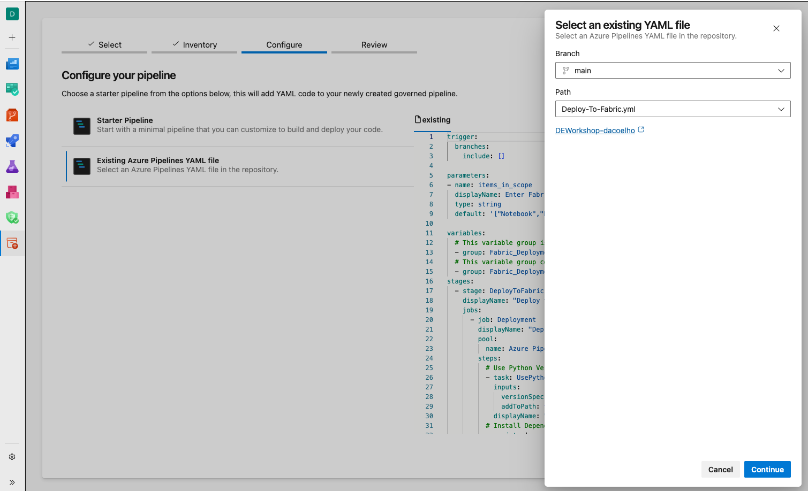
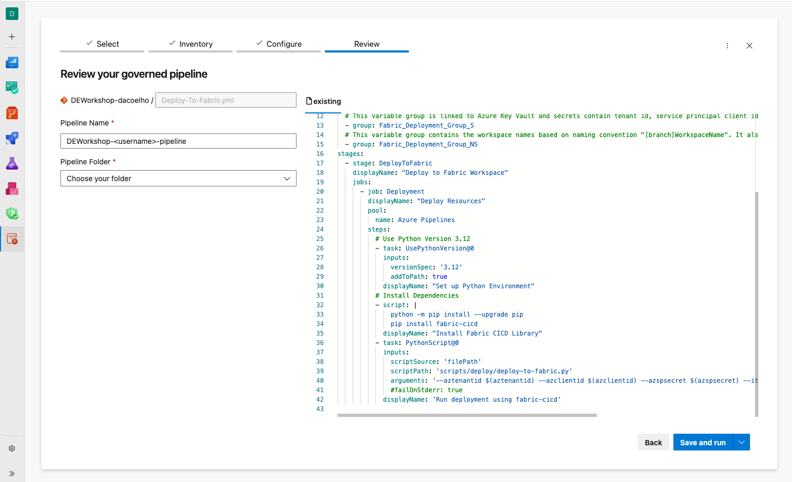

# Module 7: Azure DevOps Pipelines - Git-Based Deployments

> [!NOTE]
> **Duration:** 45 minutes | **Difficulty:** Advanced | [← Back to End-to-End Pipeline](./full-run.md) | [Next: Schema Evolution →](../versioning/data-artifact-changes.md)

## Overview

Transform your workflow from Fabric UI-driven deployment pipelines to **git-based Azure DevOps automation** using the fabric-cicd Python library. This approach provides complete automation triggered by pull requests, moving away from manual Fabric deployment pipeline operations.

**Simple Workflow**: 
1. **Development** (main branch) → **Pull Request to test branch** → **Auto-deploy to Test workspace**
2. **Test branch** → **Pull Request to production branch** → **Auto-deploy to Production workspace**

This establishes the foundation for advanced data operations and provides enterprise-grade automation capabilities.

## Learning Objectives

- Remove Fabric native deployment pipelines in favor of git-based automation
- Create simple Azure DevOps YAML pipelines triggered by pull requests
- Deploy to Test and Production workspaces automatically via fabric-cicd in Azure DevOps Pipelines
- Execute git-based promotion workflows (dev → test → prod)
- Understand security implications of simplified authentication

## Prerequisites

- Completed three-stage setup: [Full Pipeline Run](./full-run.md)
- Azure DevOps project: `DEWorkshop-<username>` with three branches (main, test, production)
- Three workspaces operational from lab 6:
  - `DEWorkshop_<username>` (Development - main branch)
  - `DEWorkshop_<username>_Test` (Test - test branch)
  - `DEWorkshop_<username>_Prod` (Production - production branch)
- Make sure all workspaces and `Synced` with git and there are no pending deployment pipelines executions.

## Part 1: Understanding Azure DevOps vs Fabric Pipelines

### Microsoft Fabric CI/CD workflow options

In this module we will show how to achieve deployment automation using Azure DevOps Pipelines with the fabric-cicd library, using the inherited branching strategy from previous modules. We'll keep it simple and won't use features like Azure Key Vault to protect secrets and Service Principals for connectivity. Those are key requirements to be considered when leveraging this codebase into your organization.

This is one of several options for implementing CI/CD with Microsoft Fabric. To learn more about best practices and other options of how to implement CI/CD with Microsoft Fabric, refer to the official guide [CI/CD workflow options in Fabric](https://learn.microsoft.com/en-us/fabric/cicd/manage-deployment).

### Key Differences and Advanced Capabilities

**Fabric Native Deployment Pipelines**:
- ✅ Simple UI-driven deployment
- ✅ Built-in workspace-to-stage mapping
- ✅ Integrated with Fabric security model
- ❌ Limited customization for complex scenarios
- ❌ No pre/post deployment hooks
- ❌ Limited integration with external systems

**Azure DevOps Pipelines with fabric-cicd**:
- ✅ **Full automation** with zero manual intervention
- ✅ **Custom pre/post deployment hooks** for data operations
- ✅ **Integration capabilities** with external systems (databases, APIs)
- ✅ **Advanced approval workflows** with stakeholder notifications
- ✅ **Rollback mechanisms** for failed deployments
- ✅ **Parallel execution** of independent deployment tasks
- ✅ **Comprehensive logging** and audit trails
- ✅ **Secret management** through Azure Key Vault integration
- ✅ **Custom validation** logic and quality gates

## Part 2: One-Time Setup - Remove Fabric Deployment Pipelines

Before moving to Azure DevOps automation, we need to remove the Fabric native deployment pipelines created in previous modules.

1. **Navigate to Fabric Deployment Pipelines**
   - Open Microsoft Fabric portal
   - Navigate to **Deployment pipelines** or to any workspace bound to the pipeline from Module 5 or 6.

2. **Delete existing deployment pipeline**
   - Click on your deployment pipeline
   - Click **Pipeline settings** (ellipsis icon)
   - Select **Delete pipeline**
   - Confirm deletion

3. **Disconnect DEWorkshop_<username>_Prod workspace from git**
   - Navigate to DEWorkshop_<username>_Prod workspace
   - Click **Workspace settings**
   - Go to **Git Integration**
   - Click on **Disconnect workspace**, confirm when prompted

4. **Disconnect DEWorkshop_<username>_Test workspace from git**
   - Navigate to DEWorkshop_<username>_Test workspace
   - Click **Workspace settings**
   - Go to **Git Integration**
   - Click on **Disconnect workspace**, confirm when prompted

Only the DEWorkshop_<username> workspace should remain connected to the `main` branch.

Whenever make changes in the development workspace, we will use Azure DevOps to create pull-requests to merge into test and then production branches.

Those actions will trigger the deployment pipeline execution in Azure DevOps Pipelines.

> [!IMPORTANT]
> **Why Remove Fabric Deployment Pipelines?**
> 
> We're transitioning from Fabric UI-driven deployments to **git-based Azure DevOps automation** because:
> - **Full automation**: Zero manual intervention required
> - **PR-driven workflow**: Changes deploy automatically when PRs are approved
> - **Custom validation**: Add pre/post deployment hooks
> - **Enterprise integration**: Connect with external systems and approval workflows
> - **Advanced logging**: Complete audit trails for all deployments

> [!NOTE]
> You can also orchestrate Fabric Deployment Pipelines using Public APIs. If Fabric Deployment Pipelines functionality is enough for your use case, use Public APIs to orchestrate in Azure DevOps Pipelines or other standardized tooling in your organization. This scenario is documented in [Option 3 - Deploy using Fabric deployment pipelines](https://learn.microsoft.com/en-us/fabric/cicd/manage-deployment#option-3---deploy-using-fabric-deployment-pipelines)

## Part 3: Configure Service Principals

Configuring service principals is a fundamental activity for external orchestration and automation. Service Principals allow trusted access from applications to make modifications in your workspace.

Service principals were already provisioned for this workshop, so you only need to configure them in your Fabric workspaces.

### Service Principal Distribution Table

The following table shows which Service Principal (SPN) each user should configure based on their user number:

| User Range | Service Principal | deploy-to-fabric.yml value |
|------------|-------------------|----------------------------|
| CICD.User001-009 | CICD.spn000 | SPN00 |
| CICD.User010-019 | CICD.spn001 | SPN01 |
| CICD.User020-029 | CICD.spn002 | SPN02 |
| CICD.User030-039 | CICD.spn003 | SPN03 |
| CICD.User040-049 | CICD.spn004 | SPN04 |
| CICD.User050-059 | CICD.spn005 | SPN05 |
| CICD.User060-069 | CICD.spn006 | SPN06 |
| CICD.User070-079 | CICD.spn007 | SPN07 |
| CICD.User080-089 | CICD.spn008 | SPN08 |
| CICD.User090-099 | CICD.spn009 | SPN09 |
| CICD.User100-109 | CICD.spn010 | SPN10 |
| CICD.User110-119 | CICD.spn011 | SPN11 |
| CICD.User120-129 | CICD.spn012 | SPN12 |
| CICD.User130-139 | CICD.spn013 | SPN13 |
| CICD.User140-149 | CICD.spn014 | SPN14 |
| CICD.User150-159 | CICD.spn015 | SPN15 |
| CICD.User160-169 | CICD.spn016 | SPN16 |
| CICD.User170-179 | CICD.spn017 | SPN17 |
| CICD.User180-189 | CICD.spn018 | SPN18 |
| CICD.User190-199 | CICD.spn019 | SPN19 |
| CICD.User200-209 | CICD.spn020 | SPN20 |

**Instructions:**
1. **Find your user number** in the User Range column
2. **Identify your Service Principal** from the corresponding SPN column
3. **Add the Service Principal as an Admin** to all your workspaces:
    - `DEWorkshop_<username>` (Development)
    - `DEWorkshop_<username>_Test` (Test)  
    - `DEWorkshop_<username>_Prod` (Production)

**Example Mappings:**
- `CICD.User004` → uses `CICD.spn000` (CICD.SPN00)
- `CICD.User119` → uses `CICD.spn011` (CICD.SPN11)
- `CICD.User209` → uses `CICD.spn020` (CICD.SPN20)

### Adding Service Principal to Workspace

For each workspace, follow these steps:

1. **Navigate to Workspace Settings**
    - Open your workspace in Microsoft Fabric
    - Click **Manage Access**

2. **Manage Access**
    - Go to **Access** tab
    - Click **Add people or groups**

3. **Add Service Principal**
    - Enter the Service Principal name: `CICD.spn###` (replace ## with your assigned number)
    - Select **Admin** role
    - Click **Add**



4. **Repeat for All Workspaces**
    - Perform the same steps for Development, Test, and Production workspaces

> [!IMPORTANT]
> **Critical Configuration Step**
> 
> The Service Principal must have **Admin** permissions in all three workspaces for the Azure DevOps pipeline to successfully deploy artifacts using fabric-cicd. Without proper permissions, deployments will fail with authentication errors.

## Part 4: Review and Modify Azure DevOps Deployment Scripts

### Understanding the files

The files are YAML pipeline definition, YAML parameter file and a Python script.

#### `deploy-to-fabric.yml`

Defines the release pipeline:

- Specifies which branches trigger the pipeline
- Defines the environment specific values to enable parameterization
- Steps to install the `fabric-cicd` library and invoke the Python script

#### `deploy-to-fabric.py`

- Accepts the arguments passed in from the yaml file
- Uses the `fabric-cicd` module to deploy items based on the branch and configuration

#### `DE_Workshop/parameter.yml`

- Used by fabric-cicd module to control remapping
- Defines the stage specific parameters for each branch

Now lets modify the `yml` files.

### Step 4.1: Modify deploy-to-fabric.yml

1. Open your Azure DevOps repository in the browser tab. (Keep it handy, we'll use it a lot in this module)
1. Navigate to the **Files** section.
1. Open `deploy-to-fabric.yml` and click **Edit**.
1. Update the azureSubscription in line 24 aligned to the first two numbers in your user alias. Use the values from the mapping table above. I.e. CICD.User004 should use SPN00, CICD.User209 should use SPN20, CICD.User119 should use SPN11.  This ensures we spread the load evenly.
1. Update the values in lines 29-31 with your workspace names, ensuring that they match exactly to the workspace names in Fabric.
1. Click **Commit changes** to finalize the changes.

### Step 4.2: Get Resource IDs and modify DE_Workshop/parameter.yml

1. Retrieve workspace and Lakehouse_Bronze IDs using fabric-cli
   ```bash
   fab config set mode interactive

   fab auth login

   # Get Development workspace details
   fab:/$ cd /DEWorkshop_<username>.Workspace
   fab:/DEWorkshop_<username>.Workspace$ get . -q id  # Workspace ID
   fab:/DEWorkshop_<username>.Workspace$ get Lakehouse_Bronze.Lakehouse -q id  # Bronze ID
   fab:/DEWorkshop_<username>.Workspace$ get Lakehouse_Silver.Lakehouse -q id  # Silver ID
   ```
1. Open `DE_Workshop/parameter.yml` and click **Edit**.
1. Update line 3 with your Development Bronze Lakehouse ID
1. Update line 9 with your Development Silver Lakehouse ID
1. Update line 15 with your Development workspace ID
1. Click **Commit changes** to finalize the changes.

## Part 5: Azure DevOps Configuration

Navigate to Azure DevOps, Pipelines section:



On the wizard:

1. Click on "Azure DevOps"
1. Select your repository "<username>" i.e. "User209"
1. Click "Configure Pipeline"
1. On the "Configure Pipeline" tab, click "Existing Azure Pipelines YAML file".
1. One the "Select a YAML file" pane, select the `deploy-to-fabric.yml` file from the main branch root directory.
1. Click **Continue**.
1. Click **Review Pipeline**.
1. Give the pipeline a name: "<username>" i.e. "User209"



**At the end, click on the `Save and Run` to select `Save` only!**



## Part 6: Execute End-to-End Pipeline

### Step 6.1: Test Pipeline with a simple Development Change

1. **Make a change in DEWorkshop_<username> (development) workspace in Fabric**
   Navigate to your Development workspace and modify the Validations notebook with a simple change, by adding a markdown cell or adding/changing a query.

2. **Commit change to development branch**
   - Save the notebook in Development workspace 
   - Use Git integration to sync to `main` branch
   - Add commit message: "Add Azure DevOps pipeline validation to Transformations notebook"

### Step 6.2: Create Pull Request to Test Environment

1. **Create Pull Request from main to test branch**
    - In Azure DevOps, navigate to **Repos** → **Pull requests**
    - Click **New pull request**
    - Source branch: `main`
    - Target branch: `test`
    - Title: "Deploy validation changes to test environment"
    - Description: "Deploying notebook changes to test workspace via Azure DevOps pipeline"
    - Click **Create**

2. **Complete the Pull Request**
    - Click **Complete**
    - Select **Complete merge** to finalize

### Step 6.3: Monitor Pipeline Execution

1. **Navigate to Pipeline Run**
    - Go to **Pipelines** → **Pipelines**
    - Click on your pipeline: `"<username>"` i.e. "User000"
    - Find the latest run triggered by the PR merge

2. **Monitor Deployment Progress**
    - Watch the pipeline stages execute:
      - **Install fabric-cicd** - Python package installation
      - **Deploy to Test** - fabric-cicd deployment execution
    - Check logs for deployment status and any errors

3. **Verify Test Environment Deployment**
    - Pipeline should complete successfully
    - Note the workspace ID resolution in logs
    - Confirm fabric-cicd deployment completion

### Step 6.4: Validate Test Deployment

1. **Open Test Workspace in Fabric**
    - Navigate to `DEWorkshop_<username>_Test` workspace
    - Open the **Validations** notebook
    - Verify your changes are present

2. **Confirm Deployment Success**
    - Changes from development should be visible in test
    - Notebook should reflect the modifications you made
    - All other items should remain unchanged

## Part 7: Production Pipeline Execution

### Step 7.1: Create Pull Request to Production

1. **Create Pull Request from test to production branch**
    - In Azure DevOps, navigate to **Repos** → **Pull requests**
    - Click **New pull request**
    - Source branch: `test`
    - Target branch: `production`
    - Title: "Deploy validated changes to production environment"
    - Description: "Promoting tested notebook changes to production workspace"
    - Click **Create**

### Step 7.3: Monitor Production Pipeline Execution

1. **Watch Production Deployment**
    - Return to **Pipelines** → **Pipelines**
    - Monitor the production stage execution
    - Verify fabric-cicd completes successfully

2. **Check Deployment Logs**
    - Review the deployment output
    - Confirm workspace ID resolution for production
    - Verify all items deployed without errors

### Step 7.4: Validate Production Deployment

1. **Open Production Workspace in Fabric**
    - Navigate to `DEWorkshop_<username>_Prod` workspace
    - Open the **Validations** notebook
    - Verify your changes are present

2. **Confirm End-to-End Success**
    - All changes propagated: Development → Test → Production
    - Azure DevOps pipeline executed successfully
    - Approval gates worked as expected
    - fabric-cicd deployed items correctly

> **🎉 Congratulations!** You've successfully implemented a complete git-based CI/CD pipeline for Microsoft Fabric using Azure DevOps. Your changes now flow automatically from development through test to production with proper approvals and validation at each stage.

---

## 🎓 INSTRUCTOR CHECKPOINT #3: Module 8 Readiness Validation

> [!IMPORTANT]
> **Critical Module 8 Prerequisites Check** - This checkpoint ensures Azure DevOps automation infrastructure is perfectly configured for advanced schema evolution patterns.

### Before proceeding to Module 8, verify with your instructor:

#### ✅ **Azure DevOps Foundation Established**

- [ ] Environments configured (Test, Production)
- [ ] YAML pipeline executing successfully end-to-end
- [ ] fabric-cicd Python package working
- [ ] Deployment hooks infrastructure created and tested

#### � **Module 8 Prerequisites Validated**

**Required Infrastructure**:
- [ ] Git branching: main, test, development branches configured
- [ ] Variables: All IDs configured

**Critical Capabilities Verified**:
- [ ] **Schema Change Automation**: Pipeline can deploy changes
- [ ] **Environment Isolation**: Changes tested in Development before Production
- [ ] **Audit Trails**: Full logging of all deployment operations

> [!SUCCESS]
> **Perfect Module 7 → Module 8 Transition**  
> Your Azure DevOps foundation is now ready for enterprise-grade schema evolution patterns and advanced data engineering workflows.

**Instructor Sign-off**: _________________ **Time**: _______

---

## Next Steps: Preparing for Advanced Data Operations

You've successfully established the Azure DevOps foundation that enables **advanced data engineering patterns**. Your pipeline now provides:

### ✅ **Enterprise-Grade Foundation Established**

**Infrastructure Ready**:
- ✅ Three-stage deployment pipeline (Development → Test → Production)
- ✅ Service principal authentication for automated deployments
- ✅ fabric-cicd integration for programmatic Fabric management
- ✅ Git-based promotion workflows through Azure DevOps

### 🎯 **Module 8 Advanced Topics**

- **Schema Evolution Patterns**: [Data Artifact Changes](../versioning/data-artifact-changes.md) ← **Next Module**
- **Non-Destructive Migration Strategies**: Safe approaches to risky data changes
- **Advanced Spark SQL DDL**: CREATE TABLE AS, ALTER TABLE, schema evolution
- **Risk Management**: "Fix forward" approaches instead of rollback procedures

The Azure DevOps pipeline infrastructure you've built provides the **secure, auditable, and automated foundation** essential for enterprise data engineering workflows with Microsoft Fabric.

## References

- [fabric-cicd Python Package](https://github.com/microsoft/fabric-cicd) - Advanced deployment automation
- [Azure DevOps YAML Schema](https://docs.microsoft.com/azure/devops/pipelines/yaml-schema) - Pipeline configuration reference
- [Azure Service Principal Best Practices](https://docs.microsoft.com/azure/active-directory/develop/howto-create-service-principal-portal) - Authentication patterns
- [Microsoft Fabric REST APIs](https://learn.microsoft.com/rest/api/fabric/) - API reference for custom integrations
