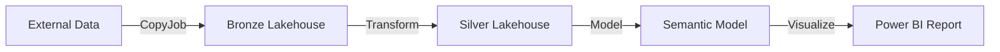

# Module 2: First Deployment - Building Your Foundation

> [!NOTE]
> **Duration:** 30 minutes | **Difficulty:** Beginner | [← Back to Setup](../configuration/start.md) | [Next: Version Control →](../versioning/start.md)

## 🎯 Module Objectives

In this module, you'll deploy your first complete data engineering solution to Microsoft Fabric:

✅ Deploy a medallion architecture (Bronze → Silver)  
✅ Create and populate Lakehouses with sample data  
✅ Set up data transformation notebooks  
✅ Configure a semantic model and Power BI report  
✅ Validate the end-to-end data flow

## 📋 Module Exercise Flow

You'll complete 5 deployment exercises:

| Exercise | Task | Duration | Status |
|----------|------|----------|--------|
| **1** | Authenticate Fabric CLI | 3 min | ⬜ Ready |
| **2** | Run Bootstrap Deployment | 10 min | ⬜ Ready |
| **3** | Verify Workspace Contents | 5 min | ⬜ Ready |
| **4** | Validate Data in Lakehouses | 5 min | ⬜ Ready |
| **5** | Test Complete Solution | 7 min | ⬜ Ready |

> **Track Your Progress:** Check off each exercise as you complete it!  

> [!TIP]
> **What's a Medallion Architecture?**  
> A data quality pattern where data flows through stages:  
> 🥉 **Bronze**: Raw, unprocessed data  
> 🥈 **Silver**: Cleaned, validated data  
> 🥇 **Gold**: Business-ready analytics data

## 🏗️ What You'll Build

Your deployment will create a complete analytics solution:



### Fabric Items You'll Deploy:
| Item | Type | Purpose |
|------|------|---------|  
| **Lakehouse_Bronze** | Lakehouse | Store raw ingested data |
| **Lakehouse_Silver** | Lakehouse | Store processed, clean data |
| **MyLHCopyJob** | Copy Activity | Import external data |
| **Transformations** | Notebook | Process Bronze → Silver |
| **Validations** | Notebook | Check data quality |
| **MySemanticModel** | Semantic Model | Define business logic |
| **MyReport** | Report | Visualize insights |

## 📋 Pre-Deployment Checklist

> [!IMPORTANT]
> Ensure all items are checked before proceeding:

- ✅ Completed [Module 1: Environment Setup](../configuration/start.md)
- ✅ Terminal/Command Prompt is open
- ✅ Virtual environment is activated (see `(fabric-de-workshop)` in prompt)
- ✅ Logged into Fabric portal with workshop credentials
- ✅ Ready to authenticate fabric-cli (we'll do this next)

## 🚀 Deployment Steps

---

## 📝 Exercise 1: Authenticate Fabric CLI (3 minutes)

> **Goal:** Connect fabric-cli to your Microsoft Fabric account.
>
> [!NOTE]
> This is a one-time setup that persists across sessions.

```bash
# Authenticate with Fabric
fab auth login
```

**What happens:**
1. Browser opens to Microsoft login
2. Sign in with workshop credentials
3. Grant permissions to fabric-cli
4. Return to terminal when complete

**Verify authentication:**
```bash
fab auth status
```

Should list account, tenant id and other information.

### ✅ Exercise 1 Checkpoint

**Before continuing, verify:**
- [ ] Browser opened for authentication
- [ ] Successfully logged in with workshop credentials
- [ ] `fab auth status` shows your email
- [ ] No authentication errors

✨ **Exercise 1 Complete!** Fabric CLI is authenticated.

---

## 📝 Exercise 2: Run Bootstrap Deployment (10 minutes)

> **Goal:** Deploy the complete data engineering solution to your workspace.

### Step 2.1: Navigate to Deployment Directory

```bash
# From the workshop root directory
cd deployment/

# Verify you're in the right place
ls
# You should see: first_deployment.sh, bootstrap.md, etc.
```

### Step 2.2: Execute the Deployment Script

> [!IMPORTANT]
> Replace ```yourusername``` with the name provided by your instructor. Remove the `CICD.` prefix. No email suffix. Lowercase.
> For example: If your user is: **`CICD.user020`**, use **`user020`**
> Replace "Your-Capacity-Name" with the actual capacity name provided by your instructor. 

**For Windows (WSL)/macOS/Linux:**
```bash
./first_deployment.sh \
    --username yourusername \
    --capacity-name "Your-Capacity-Name"
```

> [!TIP]
> **Confirming Your Capacity Name:**
> 1. Go to Fabric portal
> 2. Click Settings (⚙️) → Admin portal
> 3. Select "Capacities"
> 4. Copy the exact capacity name

### Step 3: Monitor the Deployment Progress

> [!NOTE]
> This process takes 5-10 minutes. Each step will show progress indicators.

**What the script does:**

| Stage | Action | Duration |
|-------|--------|----------|
| 1️⃣ | Create workspace `DEWorkshop_<username>` | ~30 sec |
| 2️⃣ | Assign to Fabric capacity | ~10 sec |
| 3️⃣ | Create Bronze & Silver Lakehouses | ~1 min |
| 4️⃣ | Import notebooks and artifacts | ~2 min |
| 5️⃣ | Configure data connections | ~1 min |
| 6️⃣ | Load sample data | ~2 min |
| 7️⃣ | Open workspace in browser | Instant |

### Step 4: Watch for Success Messages

**Expected output:**
```text
_ creating staging directory...
* Done

_ creating a workspace...
...

_ assigning capacity...
...

_ creating lakehouses...
Creating a new Lakehouse...
* 'Lakehouse_Bronze.Lakehouse' created
Creating a new Lakehouse...
* 'Lakehouse_Silver.Lakehouse' created

_ importing an environment...
Importing './tmp/MyEnv.Environment' → '/DEWorkshop_yourusername.Workspace/MyEnv.Environment'...
* Updated Spark Settings
* Published
* 'MyEnv.Environment' imported

_ getting items metadata...
  - Workspace ID: cbf21339-2d31-4f00-b6bd-2751c5ec2e84
  - Lakehouse Bronze ID: 025370db-d6cf-4dd5-b4dd-c97db285e4a2
  - Lakehouse Silver ID: 0b56b1e2-e931-495d-8bce-dc44178c9327
  - Lakehouse Silver SQL Endpoint ID: a6048652-3afc-4fad-ad90-af7d38c506ff
  - Lakehouse Silver SQL Endpoint Conn String: x6eps4xrq2xudenlfv6naeo3i4-hej7fszrfuae7nv5e5i4l3boqq.msit-datawarehouse.fabric.microsoft.com
* Done

_ importing a notebook...
Importing './tmp/Bronze_Data_Preparation.Notebook' → '/DEWorkshop_yourusername.Workspace/Bronze_Data_Preparation.Notebook'...
* 'Bronze_Data_Preparation.Notebook' imported
! Modifying properties may lead to unintended consequences
Setting new property for 'Bronze_Data_Preparation.Notebook'...
* Item updated

_ importing a notebook...
Importing './tmp/Transformations.Notebook' → '/DEWorkshop_yourusername.Workspace/Transformations.Notebook'...
* 'Transformations.Notebook' imported
! Modifying properties may lead to unintended consequences
Setting new property for 'Transformations.Notebook'...
* Item updated

_ importing a notebook...
Importing './tmp/Validations.Notebook' → '/DEWorkshop_yourusername.Workspace/Validations.Notebook'...
* 'Validations.Notebook' imported
! Modifying properties may lead to unintended consequences
Setting new property for 'Validations.Notebook'...
* Item updated
! Modifying properties may lead to unintended consequences
Setting new property for 'Bronze_Data_Preparation.Notebook'...
* Item updated

_ importing a copy job...
Importing './tmp/MyLHCopyJob.CopyJob' → '/DEWorkshop_yourusername.Workspace/MyLHCopyJob.CopyJob'...
* 'MyLHCopyJob.CopyJob' imported

_ importing a copy job...
Importing './tmp/MyLHCopyJob2.CopyJob' → '/DEWorkshop_yourusername.Workspace/MyLHCopyJob2.CopyJob'...
* 'MyLHCopyJob2.CopyJob' imported

_ running a copy job...
CopyJob started. Waiting for completion...

_ running a copy job...
CopyJob started. Waiting for completion...
* CopyJob executions finished

_ creating t2 shortcut to silver lakehouse...
Creating a new Shortcut...
* 't2.Shortcut' created

_ running notebook...
Running job (sync) for 'Bronze_Data_Preparation.Notebook'...
∟ Job instance 'c0c3ac83-5db5-4d17-9eca-36f75fd6e1b3' created
∟ Timeout: no timeout specified
∟ Job instance status: NotStarted
...
∟ Job instance status: InProgress
∟ Job instance status: Completed
* Job instance 'c0c3ac83-5db5-4d17-9eca-36f75fd6e1b3' Completed

_ creating t3 shortcut to silver lakehouse...
Creating a new Shortcut...
* 't3.Shortcut' created

_ running notebook...
Running job (sync) for 'Transformations.Notebook'...
∟ Job instance '5167928c-a393-4fbf-a8f0-696f69bf50a1' created
∟ Timeout: no timeout specified
∟ Job instance status: NotStarted
...
∟ Job instance status: NotStarted
∟ Job instance status: Completed
* Job instance '5167928c-a393-4fbf-a8f0-696f69bf50a1' Completed

_ importing a semantic model...
Importing './tmp/MySemanticModel.SemanticModel' → '/DEWorkshop_yourusername.Workspace/MySemanticModel.SemanticModel'...
* 'MySemanticModel.SemanticModel' imported

_ importing a powerbi report...
Importing './tmp/MyReport.Report' → '/DEWorkshop_yourusername.Workspace/MyReport.Report'...
* 'MyReport.Report' imported

_ opening workspace...
Opening 'DEWorkshop_yourusername.Workspace' in the web browser...
* https://app.powerbi.com/groups/cbf21339-2d31-4f00-b6bd-2751c5ec2e84/list?experience=fabric-developer

_ cleaning up staging directory...
* Done
```

> [!SUCCESS]
> If you see "Deployment complete!", you're ready to validate!

### ✅ Exercise 2 Checkpoint

**Before continuing, verify:**
- [ ] Script ran without errors
- [ ] "Deployment complete!" message appeared
- [ ] Browser opened to your workspace
- [ ] All progress indicators showed ✓

🚀 **Exercise 2 Complete!** Solution is deployed to Fabric.

---

## 📝 Exercise 3: Verify Workspace Contents (5 minutes)

> **Goal:** Confirm all artifacts were created successfully in your workspace.

### Step 3.1: Check Workspace Items

**In the Fabric portal, your workspace should show:**

| Item | Type | Status Check |
|------|------|-------------|
| Lakehouse_Bronze | 🏠 Lakehouse | Should contain 4 tables |
| Lakehouse_Silver | 🏠 Lakehouse | Should contain 3 tables |
| MyLHCopyJob | 📥 Copy Activity | Status: Completed |
| MyLHCopyJob2 | 📥 Copy Activity | Status: Completed |
| Bronze_Data_Preparation | 📓 Notebook | Ready to run |
| Transformations | 📓 Notebook | Ready to run |
| Validations | 📓 Notebook | Ready to run |
| MyEnv | Environment |  |
| MySemanticModel | 📊 Semantic Model | Connected to Silver (refresh it!) |
| MyReport | 📈 Report | Should open without errors (refresh it!) |

### ✅ Exercise 3 Checkpoint

**Before continuing, verify:**
- [ ] All items visible in workspace
- [ ] Items show correct types (Lakehouse, Notebook, etc.)
- [ ] No error indicators on any items
- [ ] Workspace name matches `DEWorkshop_<username>`

📁 **Exercise 3 Complete!** All artifacts are present.

---

## 📝 Exercise 4: Validate Data in Lakehouses (5 minutes)

> **Goal:** Verify that data was successfully loaded into your Lakehouses.

> [!NOTE]
> The **Validations** notebook contains automated checks for all data quality and table counts.

1. **Open the Validations notebook:**
    - Click on **Validations** in your workspace
    - The notebook will open in edit mode

2. **Execute the validation checks:**
    - Make sure MyEnv is selected as the environment
    - Click **Run all** button at the top
    - Wait for all cells to complete (approximately 1-2 minutes)
    - Verify the table counts. The created shortcut to t3 should point to t3_dev in Bronze Lakehouse.

### ✅ Exercise 4 Checkpoint

**Before continuing, verify:**
- [ ] Bronze Lakehouse has `dbo.t2` table with data
- [ ] Silver Lakehouse has all 4 tables (t1, t2, t3)
- [ ] All tables contain rows (not empty)
- [ ] Can preview data without errors

📦 **Exercise 4 Complete!** Data is loaded correctly.

---

## 📝 Exercise 5: Test Complete Solution (7 minutes)

> **Goal:** Validate the end-to-end solution including transformations and reporting.

### Step 5.1: Run Data Quality Checks

> [!TIP]
> This helps you understand the data flow and validates transformations

1. Open **Validations** notebook
2. Click **Run all** button
3. Review output showing:
   - Row counts for each table
   - Data quality metrics
   - Schema validations
4. All checks should pass ✅

### Step 5.2: Test Semantic Model and Report

#### 📊 Verify Semantic Model:
1. Open **MySemanticModel**
2. Check data source connection:
   - Should point to `Lakehouse_Silver`
   - Table `dbo.t1` should be imported
3. Click **Refresh now** to update data

#### 📈 Open the Report:
1. Click on **MyReport**
2. Report should display:
   - Dashboard with charts
   - Interactive filters
   - No error messages
3. Try interacting with filters to ensure responsiveness

> [!SUCCESS]
> **Congratulations!** You've deployed your first Fabric solution! 🎉

### ✅ Exercise 5 Checkpoint

**Before continuing, verify:**
- [ ] Validations notebook ran successfully
- [ ] All data quality checks passed
- [ ] Semantic model refreshed without errors
- [ ] Report displays charts and data
- [ ] Filters work interactively

🎆 **Exercise 5 Complete!** Your solution is fully operational!

## 🔧 Troubleshooting Guide

### Common Issues & Quick Fixes

| Problem | Solution |
|---------|----------|
| **"Workspace already exists"** | Delete it: `fab rm -f /DEWorkshop_<username>` |
| **"Not authenticated"** | Run: `fab auth login` |
| **"Capacity not found"** | Check exact capacity name in Admin Portal |
| **"Permission denied"** | Ensure you have workspace admin rights |
| **Script not executable** | Mac/Linux: Run `chmod +x first_deployment.sh` |
| **Tables missing data** | Re-run the deployment script |
| **Report shows errors** | Refresh semantic model first |

### Helpful Commands

```bash
# Create workspace manually before running first_deployment.sh if needed.
fab create DEWorkshop_<username>.Workspace

# Assign capacity manually before running first_deployment.sh if needed.
fab ls .capacities
fab assign .capacities/"MY CAPACITY NAME.Capacity" -W DEWorkshop_<username>.Workspace

# View workspace contents
fab ls /DEWorkshop_<username>

# Get help on any command
fab --help
fab create --help
```

### Need More Help?

- 🙋 Ask your instructor
- 💬 Check with fellow participants
- 📖 Review [fabric-cli docs](https://github.com/microsoft/fabric-cli)

---

---

## 🎯 Module Summary

### 📊 Exercise Summary

| Exercise | Completed | What You Achieved |
|----------|-----------|------------------|
| **1. Authenticate CLI** | ✅ | Connected fabric-cli to Fabric |
| **2. Run Deployment** | ✅ | Deployed complete solution |
| **3. Verify Workspace** | ✅ | Confirmed all artifacts created |
| **4. Validate Data** | ✅ | Verified data in Lakehouses |
| **5. Test Solution** | ✅ | Validated end-to-end flow |

### ✅ Skills You've Gained:
- 🚀 Deployed a complete medallion architecture
- 📦 Created and populated Lakehouses
- 📓 Set up data transformations
- 📊 Configured a semantic model
- 📈 Validated the end-to-end solution

## 📚 What's Next?

> [!IMPORTANT]
> ### ✅ Module 2 Complete! Ready to Continue?
> 
> **Your Progress:** [1] ✅ → [2] ✅ → **[3]** → [4] → [5] → [6] → [7] → [8]
> 
> ### 🔄 **NEXT MODULE: Version Control Basics**
> 
> **📁 Location:** [`/versioning/start.md`](../versioning/start.md)  
> **⏱️ Duration:** 30 minutes  
> **🎯 You'll Learn:**
> - Connect workspace to Git repository
> - Push changes from Fabric to Git
> - Pull changes from Git to Fabric
> - Understand what gets versioned
> 
> **[→ Click here to start Module 3: Version Control Basics](../versioning/start.md)**

> [!TIP]
> **Take a Break!** This is a good stopping point if you need a quick break. Your workspace will be waiting when you return.

---

## 🎓 INSTRUCTOR CHECKPOINT #1

> [!IMPORTANT]
> **Mandatory Instructor Review** - All participants should pause here for group synchronization.

### Before proceeding to Module 3, verify with your instructor:

#### ✅ **Technical Validation**
- [ ] All participants have successfully deployed the medallion architecture
- [ ] Bronze and Silver lakehouses contain expected tables (t1, t2, t3)
- [ ] Transformations notebook executed without errors
- [ ] Power BI report displays data correctly
- [ ] Git integration is connected and showing all items

#### 📊 **Group Status Check**
```
Instructor will verify:
1. Number of participants ready: ___/___
2. Common issues encountered:
   - [ ] Authentication problems resolved
   - [ ] Deployment script errors fixed
   - [ ] Workspace permissions corrected
3. Time elapsed vs. planned: ___ minutes
```

#### 🚨 **Common Issues at This Stage**
- **Missing tables**: Run `Transformations.Notebook` again
- **Report not loading**: Check semantic model refresh
- **Git not syncing**: Verify branch connection in workspace settings

#### 💬 **Group Discussion (5 minutes)**
- What was the most challenging part so far?
- Any questions about the medallion architecture?
- Understanding of Bronze vs. Silver layers?

> [!WARNING]
> **DO NOT PROCEED** until instructor confirms all participants are ready. This checkpoint ensures everyone has a working foundation for the remaining modules.

**Instructor Sign-off**: _________________ **Time**: _______

---
