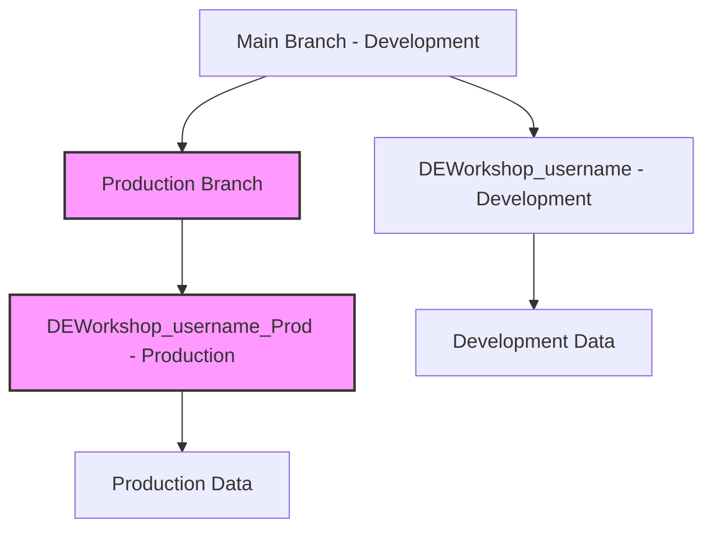
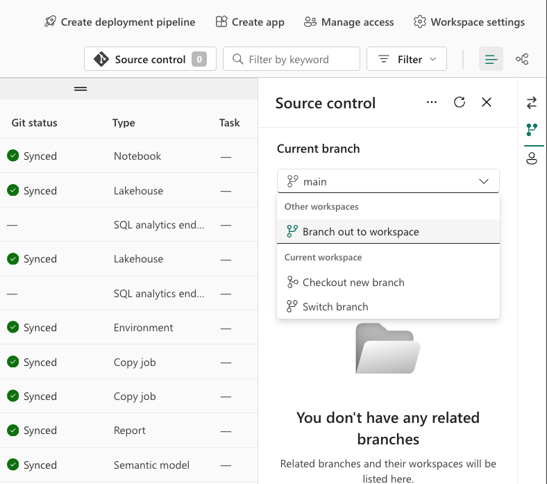
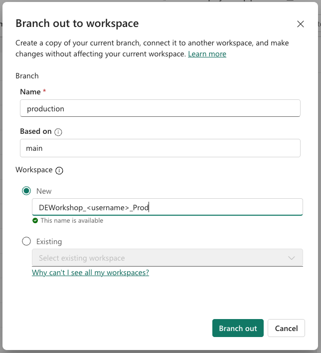
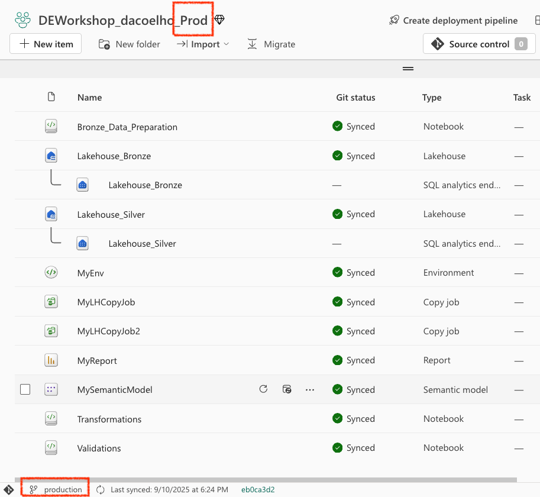
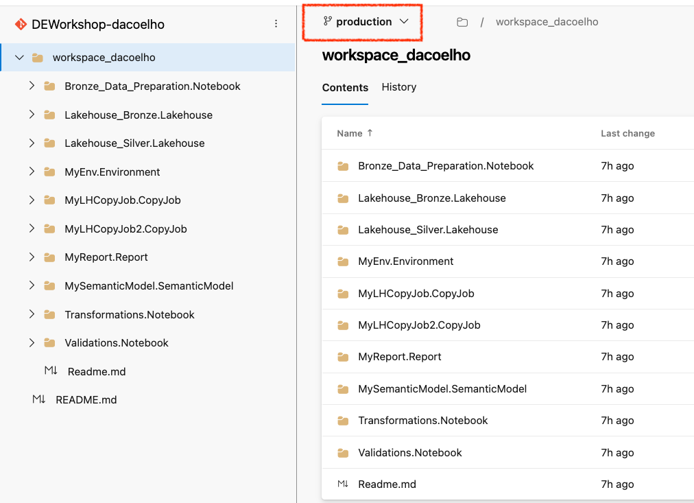
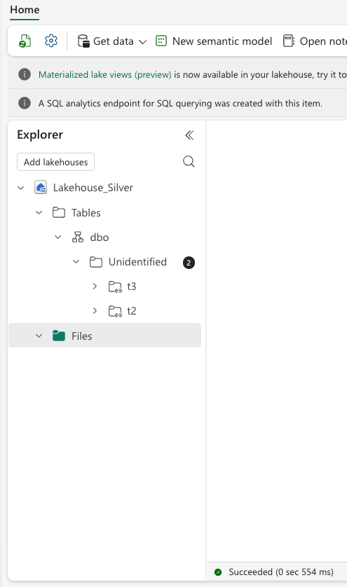
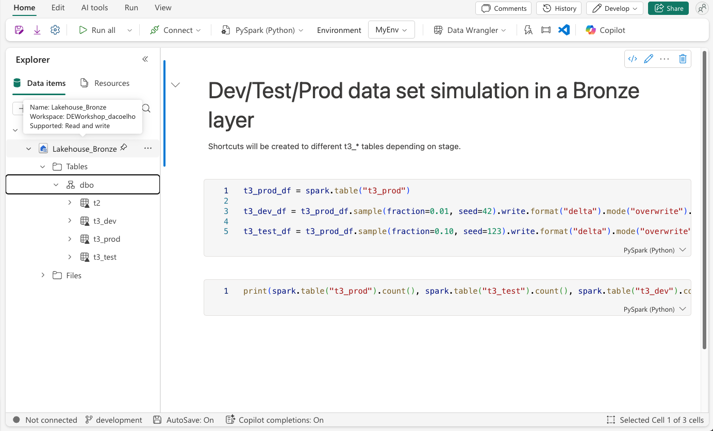
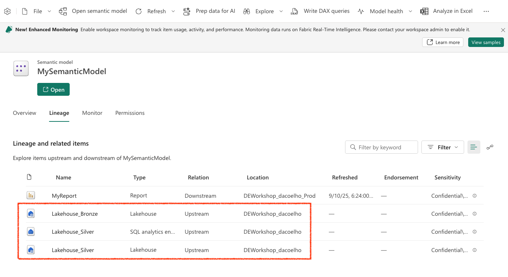

# Module 4: Branch Management - Production Environment Setup

> [!NOTE]
> **Duration:** 60 minutes | **Difficulty:** Intermediate | [← Back to Version Control](../versioning/start.md) | [Next: Deployment Pipelines →](../deployment/start.md)

## 🎯 Module Objectives

Learn how to use Microsoft Fabric's "Branch out to new workspace" capability to create isolated production environments:

✅ Create production workspace using Fabric's branch out capability  
✅ Configure production data and dependencies  
✅ Test production deployment patterns  
✅ Understand workspace isolation patterns for enterprise deployment  

> [!TIP]
> **Why Production Workspace?**  
> The `DEWorkshop_<username>` workspace represents your **development environment**, always synced with the main branch. The production workspace allows safe deployment validation and production data isolation from development workflows.

## 📋 Module Exercise Flow

You'll complete 4 hands-on exercises:

| Exercise | Task | Duration | Status |
|----------|------|----------|--------|
| **1** | Create Production Workspace | 15 min | ⬜ Ready |
| **2** | Validate Branch and Workspace Integration | 10 min | ⬜ Ready |
| **3** | Discover What's Broken | 15 min | ⬜ Ready |
| **4** | Understanding the Fix Required | 10 min | ⬜ Ready |

> **Track Your Progress:** Check off each exercise as you complete it!

## 🏗️ Architecture Overview

## 📋 Pre-Module Checklist

> [!IMPORTANT]
> Ensure all items are checked before proceeding:

- ✅ Completed [Module 3: Version Control](../versioning/start.md)
- ✅ Main workspace `DEWorkshop_<username>` synced with Git (main branch - development)
- ✅ Azure DevOps access with branch permissions
- ✅ Fabric capacity available for new workspace

---

## 📝 Exercise 1: Create Production Workspace (15 minutes)

> **Goal:** Create a production workspace using Microsoft Fabric's "Branch out to new workspace" capability.
>
> [!IMPORTANT]
> This workspace will be automatically connected to a new production branch and serve as your isolated production environment.

### Step 1.1: Use Branch Out to New Workspace

1. **Navigate to development workspace**
   - Go to your `DEWorkshop_<username>` workspace (development)
   - This workspace is currently connected to the main branch
   - Click on **Source Controls** in the ribbon

2. **Initiate branch out process**
   - Under current branch, select "Other workspaces" -> "Branch out to new workspace"
   - This feature will allow you to create a new workspace AND a new branch automatically

3. **Configure new workspace**
   - **Name**: `production` (this will be created automatically)
   - **Based on**: `main`
   - **Workspace name**: `DEWorkshop_<username>_Prod`. Make sure to replace `<username>` with your actual username. For example **`user209`**.
   - Click **Branch out**

> [!TIP]
> **What happens during branch out:**
> - ✅ New workspace created with all artifacts copied
> - ✅ New branch `production` created in Azure DevOps
> - ✅ New workspace automatically connected to new branch
> - ✅ All artifacts maintain their original structure

### ✅ Exercise 1 Checkpoint

**Before continuing, verify:**
- [ ] Production workspace `DEWorkshop_<username>_Prod` created
- [ ] Workspace assigned to capacity
- [ ] Can access the new workspace in Fabric portal

🔗 **Exercise 1 Complete!** Production workspace is ready with automatic Git integration.

---

## 📝 Exercise 2: Validate Branch and Workspace Integration (10 minutes)

> **Goal:** Verify that the branch out process created everything correctly and understand the automatic integration.
>
> [!TIP]
> **Key Concept:** Fabric's "Branch out" creates the branch in Azure DevOps AND connects the workspace automatically!

### Step 2.1: Verify in Fabric Portal

1. **Check production workspace**
   - Navigate to `DEWorkshop_<username>_Prod` workspace
   - Verify the connection shows:
     - **Branch**: `production`
     - **Status**: Synced

### Step 2.2: Verify in Azure DevOps

1. **Check branch structure**
   - Go to your `DEWorkshop-<username>` project in Azure DevOps
   - Navigate to **Repos** → **Branches**
   - You should now see TWO branches:
     - `main` (development branch)
     - `production` (created by branch out process)

2. **Verify branch contents**
   - Click on `production` branch
   - Navigate to `/workspace_items` folder
   - Confirm all artifacts are present (copied from main)

### ✅ Exercise 2 Checkpoint

**Before continuing, verify:**
- [ ] Production workspace connected to `production` branch
- [ ] Development workspace still connected to `main` branch
- [ ] Both branches exist in Azure DevOps
- [ ] Production branch contains all workspace artifacts

🔗 **Exercise 2 Complete!** Branch out process created perfect Git integration automatically.

---

## 📝 Exercise 3: Discover What's Broken (15 minutes)

> **Goal:** Understand that while code artifacts are copied, data connections and dependencies are not automatically remapped.
>
> [!WARNING]
> **Key Discovery:** We wanted a complete isolated production environment, but we don't have it yet!

### Step 3.1: Check Lakehouse Data

1. **Open Lakehouse Bronze**
   - In your `DEWorkshop_<username>_Prod` workspace
   - Open the `Lakehouse_Bronze` (Bronze layer)
   - Navigate to **Tables** section
   - **Discovery**: There are no tables! The Copy Job didn't run in this workspace.

2. **Open Lakehouse Silver**
   - Open the `Lakehouse_Silver` (Silver layer)
   - Navigate to **Tables** section
   - **Discovery**: No tables here either!
   - But check **Shortcuts** - the shortcuts are there but invalid
   - The shortcut points to Lakehouse Bronze, but Bronze has no tables

### Step 3.2: Check Notebook Connections

1. **Open Bronze_Data_Preparation notebook**
   - In your `DEWorkshop_<username>_Prod` workspace
   - Open the `Bronze_Data_Preparation`
   - Look at the notebook's **Default Lakehouse** setting
   - **Discovery**: The notebook is attached to `DEWorkshop_<username>` instead of `DEWorkshop_<username>_Prod`!

2. **Check other notebooks**
   - Open `Transformations` and `Validations`
   - **Discovery**: All notebooks point to development workspace resources!

### Step 3.3: Check Semantic Model Lineage

1. **Open Semantic Model lineage**
   - In your `DEWorkshop_<username>_Prod` workspace
   - Open `MySemanticModel`
   - Go to **Settings** → **Data source credentials**
   - **Discovery**: The mappings point to `DEWorkshop_<username>` instead of `DEWorkshop_<username>_Prod`!

2. **Check the report**
   - Open `MyReport`
   - **Discovery**: The report is working... but it's showing data from development workspace!
   - The report displays data, but it's not from your production environment

### ✅ Exercise 3 Checkpoint

**Before continuing, verify you understand what's broken:**
- [ ] Lakehouses are empty
- [ ] Shortcuts are invalid
- [ ] Notebooks are connected to development workspace
- [ ] Semantic model points to development data sources
- [ ] Report shows development data, not production data

🔗 **Exercise 3 Complete!** You've discovered the isolation is not complete yet.

> [!IMPORTANT]
> **Key Insight:** We wanted a complete isolated production environment, but we don't have it yet! The deployment script in Module 2 did a bunch of remapping of connections to point to the right places. We need to do that same remapping for our production workspace. All this will be fixed in the next module.

---

## 📝 Exercise 4: Understanding the Required Fixes (10 minutes)

> **Goal:** Understand what needs to be fixed to achieve true workspace isolation.
>
> [!NOTE]
> **Key Concept:** When we used the deployment script in Module 2, it automatically remapped all connections to point to the right workspace resources. We need that same remapping for production.

### Step 4.1: What the Deployment Script Did Differently?

When we ran the deployment script in Module 2, it handled several critical remapping operations:

1. **Lakehouse References**: Updated all notebook lakehouse connections
2. **Shortcut Targets**: Remapped shortcuts to point to correct workspace lakehouses  
3. **Semantic Model Sources**: Updated data source connections to target correct workspace
4. **Environment Dependencies**: Configured compute and data dependencies

### Step 4.2: What We Need in Production

For a truly isolated production environment, we need:

- ✅ **Remapped notebook connections** (point to production workspace lakehouses)
- ✅ **Separate execution** (Copy Jobs and Notebooks need to run in production workspace)
- ✅ **Updated semantic model lineage** (source from production workspace data)
- ✅ **Isolated report data** (show production workspace data, not development)

### Step 4.3: Preview of Next Module

In Module 5, we'll learn how to:
- Run deployment automation for production workspace
- Configure environment-specific variables
- Validate true workspace isolation

### ✅ Exercise 4 Checkpoint

**Before continuing, verify you understand:**
- [ ] Why the current setup isn't truly isolated
- [ ] What the deployment script does for connection remapping
- [ ] What we'll fix in the next module

🔗 **Exercise 4 Complete!** Ready to learn about deployment automation!

---

## 🎯 Module Takeaways

### ✅ What You Accomplished

You successfully created a production workspace using Fabric's "Branch out" capability and discovered the limitations of this approach:

1. **✅ Workspace Creation**: Used Fabric's branch out feature to create production workspace
2. **✅ Automatic Git Integration**: Branch out automatically created production branch and connected workspace
3. **✅ Code Artifacts Copied**: All notebooks, pipelines, and reports were copied to production workspace
4. **❌ Data Isolation Incomplete**: Discovered that data connections still point to development workspace

### 🔑 Key Insights

- **Branch Out Benefits**: Automatically creates branch AND connects workspace - very convenient!
- **Code vs Data**: Code artifacts sync via Git, but data connections need manual remapping
- **Connection Dependencies**: Notebooks, semantic models, and reports maintain their original workspace references
- **Deployment Automation Need**: Manual remapping is tedious - automation is essential for enterprise use

### 🚀 What's Next

In **Module 5: Deployment Pipelines**, you'll learn how to:
- Use deployment pipelines to automatically remap all workspace connections
- Configure environment-specific variables for true workspace isolation
- Run deployment automation to achieve complete production environment setup
- Validate that your production workspace is truly isolated from development

### ⏱️ Time Investment

| Exercise | Duration | Key Learning |
|----------|----------|--------------|
| **Exercise 1** | 15 min | Fabric branch out for production |
| **Exercise 2** | 10 min | Git integration validation |
| **Exercise 3** | 15 min | Discovering broken connections |
| **Exercise 4** | 10 min | Understanding the fix needed |
| **Total** | **50 min** | **Branch out limitations & solutions** |

---

> [!TIP]
> **💡 Pro Tip:** While Fabric's branch out is convenient for getting started, enterprise deployment requires deployment automation to handle all the connection remapping. That's exactly what we'll build in the next module!

**Continue to** → [Module 5: Deployment Pipelines](./start.md)
