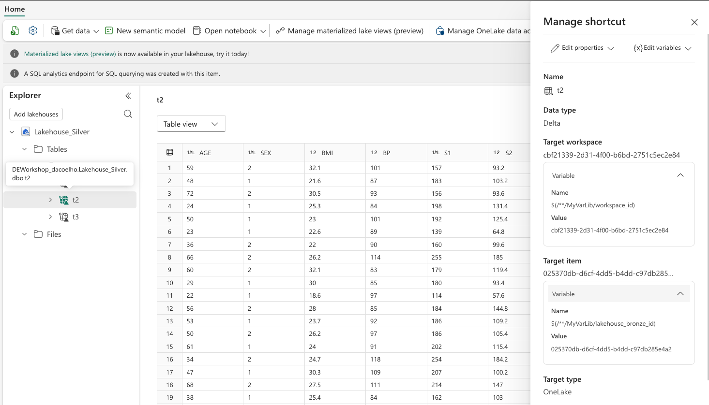
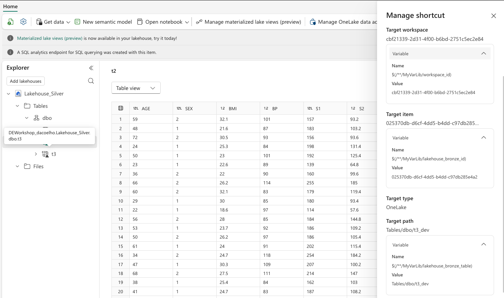

# Module 5: Deployment Pipelines - Enterprise Automation

> [!NOTE]
> **Duration:** 60 minutes | **Difficulty:** Intermediate | [← Back to Branch Management](./branch-out.md) | [Next: End-to-End Pipeline →](./full-run.md)

## Overview

Create your first Microsoft Fabric Deployment Pipeline to automate promotion between Development and Production environments. Learn how to configure variable libraries and deployment rules to handle environment-specific differences, particularly around data location mappings and cross-environment dependencies.

This lab focuses on **fixing everything broken from Module 4** using **Microsoft Fabric's native deployment pipeline** capabilities with variable libraries and deployment rules.

## Learning objectives

- Create a deployment pipeline with Development and Production stages
- Configure workspace-to-stage mappings for both environments  
- Fix broken connections using Variable Libraries and Deployment Rules
- Execute Copy Jobs, Notebooks and refresh Semantic Models in Production
- Validate that Production workspace is truly isolated and functional

## Prerequisites

- Completed bootstrap deployment: [First Deployment](./bootstrap.md)
- Completed branch development: [Branch Out to New Workspace](./branch-out.md)
- Two workspaces available:
  - `DEWorkshop_<username>` (Development - synced with main branch in git)
  - `DEWorkshop_<username>_Prod` (Production - synced with production branch in git)
- Production workspace non-functional state from Module 4

> [!IMPORTANT]
> **Focus on Fabric Deployment Pipelines**  
> This module uses Microsoft Fabric's native deployment pipeline features exclusively. While your workspaces are connected to git for version control, the deployment pipeline operates on workspace content directly and does not require git operations.

## Part 1: Create Deployment Pipeline

### Step 1.1: Access Deployment Pipelines

1. **Navigate to Deployment Pipelines**
   - In Microsoft Fabric portal, navigate to the DEWorkshop_<username> workspace
   - Click **Create Deployment Pipeline** in top right ribbon


2. **Configure pipeline basics**
   - **Pipeline name**: `DEWorkshop_<username>_Pipeline`
   - **Description**: `Automated deployment pipeline for Data Engineering workshop`
   - Click **Create**


2. **Configure pipeline stages**
   - Remove 'Test' stage. Create only Development and Production.
   - Click **Create**


### Step 1.2: Configure Development Stage

1. **Add workspace to Development stage**
   - When asked, assign to the **Development** stage
   - **⚠️ Key Concept**: Development represents our original bootstrap workspace from Lab 1


2. **Validate stage assignment**
   - Make sure `DEWorkshop_<username>` is the workspace for stage Development


### Step 1.3: Configure Production Stage

1. **Add workspace to Production stage**
   - Select `DEWorkshop_<username>_Prod` in the **Deploy to this stage or Assign a workspace** dropdown
   - This workspace contains items linked to the `production` branch
   - Click **Assign a workspace**


## Part 2: Verify stages

The stages configuration must look like this:


## Part 3: Execute First Deployment

### Step 3.1: Deploy from Development to Production

1. **Initiate deployment**
   - Click **Deploy** button between Development and Production stages
   - Review the deployment summary dialog
   - Click **Deploy** to confirm

2. **Verify deployment completion**
   - Confirm deployment completes successfully
   - Note that both stages now show identical content versions

### Step 3.2: Restest Cross-Environment Issues

1. **Navigate to Production workspace**
   - Open `DEWorkshop_<username>_Prod`
   - ⚠️ The portal now shows that the notebooks have changes! What happened?!


🚨 This is actually how the branch-out should have worked in Module 4! This is a bug and is being fixed.

✅ **Deployment Pipelines does the right thing for Notebooks! It remaps them automatically between stages.**

2. **Other elements still broken**
   - Lakehouse shortcuts still point to invalid locations and there are no tables.
   - Semantic Model and Reports are still incorrect
   - **This is why we need deployment rules and variables**

## Part 4: Variable Libraries

### Step 4.1: Understanding the Variable Library Concept

**The Challenge**: Different stages need different configurations:
- **Development**: Uses `DEWorkshop_<username>` resources
- **Production**: Uses `DEWorkshop_<username>_Prod` resources

**The Solution**: Variables that define stage-specific values. We will use Variable Libraries to remap shortcuts during deployment.

To learn more about Variable Libraries, see: [What is a variable library?](https://learn.microsoft.com/en-us/fabric/cicd/variable-library/variable-library-overview)

### Step 4.2: Get Resource IDs for Variables

1. **Retrieve workspace and Lakehouse_Bronze IDs using fabric-cli**
   ```bash
   fab config set mode interactive

   fab auth login

   # Get Development workspace details
   fab:/$ cd /DEWorkshop_<username>.Workspace
   fab:/DEWorkshop_<username>.Workspace$ get . -q id  # Workspace ID
   fab:/DEWorkshop_<username>.Workspace$ get Lakehouse_Bronze.Lakehouse -q id  # Bronze ID

   # Go back to root
   fab:/DEWorkshop_<username>.Workspace$ cd ..

   # Get Production workspace details
   fab:/ cd /DEWorkshop_<username>_Prod.Workspace
   fab:/DEWorkshop_<username>_Prod.Workspace$ get . -q id  # Workspace ID
   fab:/DEWorkshop_<username>_Prod.Workspace$ get Lakehouse_Bronze.Lakehouse -q id  # Bronze ID
   ```

You could also capture IDs by inspecting workspace and Lakehouse properties in the Fabric interface, but using fabric-cli is way faster (and cooler).

### Step 4.3: Create Variable Library

1. **Access variable libraries**
   - Navigate to the DEWorkshop_<username> workspace
   - Click **+ New item** in the ribbon
   - Select **Variable library**


2. **Configure variable library**
   - **Name**: `MyVarLib`
   - **Location**: `DEWorkshop_<username>`
   - Click **Create**


3. **Define variables**

Create the following variable library configuration using the correct IDs.

The "Default value set" is the one that will be used in the Development stage. Make sure you define the workspace_id and lakehouse_bronze_id variables containing the correct GUIDs for the Development workspace, as captured by the fabric-cli commands before.

The "Production" value set is the one that will be used in the Production stage. Make sure you define the workspace_id and lakehouse_bronze_id variables containing the correct GUIDs for the Production workspace, as captured by the fabric-cli commands before.


Make sure you **Save** the Variable Library after defining the variables.

### Step 4.4: Update your shortcut definitions to use variables

The Shortcuts in Lakehouse_Silver should be updated to use the variable definitions. Today the shortcut metadata is defined "hard-coded".

The Shorcuts need to be defined to use the correct Workspace and Lakehouse_Bronze IDs during deployment.

1. **Update Shortcut definitions**
    - Navigate to the DEWorkshop_<username> workspace (Development)
    - Open `Lakehouse_Silver`
    - Click on the ellipsis by table t2, and select `Manage Shortcut`
    - In the Manage shortcut experience, change select variables to define both `Target workspace` and `Target item`:
      - **Target workspace**: Click `Select variable` and choose `workspace_id` from MyVarLib
      - **Target item**: Click `Select variable` and choose `lakehouse_bronze_id` from MyVarLib


After selecting the values, it should look like this. The variable gets resolved after saved.



2. **Repeat the operation for table t3 in Lakehouse_Silver**

The main difference is that for t3, you also need to select the variable `lakehouse_bronze_table_name` that will control which table to point to.



Your variable library and shortcut definitions are ready to go.

> [!TIP]
> **💡 Pro Tip:** Variable definitions are expressed in git as metadata. This means that you could update all your shortcuts metadata to use variables directly in Azure DevOps and then imported back to the workspace. This is a key productivity pattern when dealing with many shortcuts.

## Part 5: Deployment Rules

### Step 5.1: Understanding Deployment Rules

**Deployment Rules** automatically handle item dependencies during deployments. We will use a deployment rule to fix the Semantic Model.

To learn more about Deployment Pipeline Rules, read [Create deployment rules](https://learn.microsoft.com/en-us/fabric/cicd/deployment-pipelines/create-rules?tabs=new-ui).

### Step 5.2: Configure Semantic Model Rules

1. **Open Deployment rules for the Production stage**
   - Navigate to Development workspace
   - Open the Deployment Pipeline
   - Click on the `Deployment Rules` icon on the Production stage


Select the Semantic Model


2. **Retrieve needed information using fabric-cli**
   ```bash
   fab config set mode interactive

   fab auth login

   # Get Production details
   fab:/ cd /DEWorkshop_<username>_Prod.Workspace
   fab:/DEWorkshop_<username>_Prod.Workspace$ get Lakehouse_Silver.Lakehouse -q properties.sqlEndpointProperties.id  # Silver SQL Endpoint ID
   fab:/DEWorkshop_<username>_Prod.Workspace$ get Lakehouse_Silver.Lakehouse -q properties.sqlEndpointProperties.connectionString  # Silver SQL Endpoint Connection String
   ```

3. **Configure rules**

Make sure you use the retrieved information to configure a `Data source` deployment rules like the screenshot bellow.
Use the value retrieved properties.sqlEndpointProperties.id for the `Database` field.
Use the value retrieved properties.sqlEndpointProperties.connectionString for the `Server` field.


**Save** and then **Close** the deployment rules dialog.

3. **Sync everything to git**
   - Navigate to Development workspace
   - Notice that Lakehouse_Silver has Uncommitted changes, as the Shortcut definitions now are changed to use variables
   - Notice that MyVarLib is a new item and is not in git yet
   - Click on *Source Control**
   - Select both items in the `Changes` pane
   - Click on **Commit**

This will make sure all metadata is synced to the main branch.

> [!TIP]
> Feel free to take a look in Azure DevOps (main branch) to see what a variable library item and shortcuts metadata (under Lakehouse_Silver.Lakehouse) with variables look like.

## 📝 Exercise 6: Run Deployment

> **Goal:** Validate that rules and variables work correctly during deployment.

### Step 6.1: Run the deployment!

1. **Open the Deployment Pipeline interface**
   - Navigate to Development workspace
   - Open the Deployment Pipeline
   - Click on **Deploy**

2. **Review the proposed changes**
   - Review the `Different` pane. It contains the Lakehouse_Silver and Semantic Model
   - Review the `New` pane. It contains the MyVarLib Variable Library
   - Click **Deploy**


### Step 6.2: Open the Production workspace and sync it to git

If the deployment did everything correct, as soon as you open the workspace, you'll see six uncommitted changes.

This makes total sense as the deployment correctly changed the definitions and those items are not yet in the production branch in the repository.

Go ahead and click **Source control** and perform the **Commit** operation.


---

## Part 6: Execute required steps to create tables, fix shortcut references, and validate everything is working in Production

### Step 6.1: Execute Copy Jobs in Production

1. **Run Copy Jobs to populate data**
   - Navigate to `DEWorkshop_<username>_Prod` workspace
   - Open `MyLHCopyJob`
   - Click **Run** to execute the Copy Job
   - Wait for completion

2. **Run second Copy Job**
   - Open `MyLHCopyJob2`
   - Click **Run** to execute
   - Verify both Copy Jobs completed successfully

### Step 6.3: Execute Notebooks and fix shortcuts

1. **Run Bronze Data Preparation**
   - Open `Bronze_Data_Preparation.Notebook` in the `DEWorkshop_<username>_Prod` workspace
   - **Verify**: Notebook is now attached to Production workspace Lakehouse_Bronze, and should have the t2 and t3_prod tables.
   - Make sure you **Connect** the notebook to a new **New high concurrency session**.
   - Click **Run all** to execute all cells
   - Confirm notebook runs successfully
   - Refresh tables in the explorer to see if all t3 tables were generated

2. **Make the MyVarLib Production variable set as the Active Set**
    - Navigate to `DEWorkshop_<username>_Prod` workspace
    - Open the Variable Library `MyVarLib`
    - Select the `Production` value set as the Active Set, by clicking on the ellipsis next to it
    - Click **Save**


After confirmation it should look like this. 


**Save** and close the variable library.

3. **Refresh the shortcut definitions in Silver Lakehouse**
    - Navigate to `DEWorkshop_<username>_Prod` workspace
    - Open Lakehouse_Silver
    - Click `Update all variables` in the ribbon


This will guarantee that Shortcut definitions of t2 and t3 are refreshed to use the Production value set from the variable library.

2. **Run Transformations**
   - Open `Transformations` notebook in the `DEWorkshop_<username>_Prod` workspace
   - **Verify**: Notebook is now attached to Production workspace Lakehouse_Silver
   - Make sure you **Connect** the notebook to an existing **high concurrency session** if available.
   - Click **Run all**
   - Validate t1 by looking at the notebook execution result cells

3. **Run Validations**
   - Open `Validations` notebook in the `DEWorkshop_<username>_Prod` workspace
   - **Verify**: Notebook is now attached to Production workspace Lakehouse_Silver
   - Make sure you **Connect** the notebook to an existing **high concurrency session** if available.
   - Click **Run all**
   - Verify if all queries run correctly

### Step 6.4: Refresh Semantic Model

1. **Refresh Semantic Model**
   - Open `MySemanticModel` in the `DEWorkshop_<username>_Prod` workspace
   - Click on the lineage tab
   - **Verify**: Data sources now point to Production workspace
   - Click **Refresh**
   - Wait for refresh to complete successfully

2. **Test Report**
   - Open `MyReport` in the `DEWorkshop_<username>_Prod` workspace
   - **Verify**: Report now shows Production data (not Development data)
   - Test all visualizations and filters

### ✅ Step 6 Checkpoint

**Before continuing, verify:**
- [ ] Deployment pipeline executed successfully
- [ ] Copy Jobs ran and completed in Production
- [ ] All notebooks executed successfully in Production
- [ ] Semantic Model refreshed from Production data
- [ ] Report shows Production data

🎉 **Step 6 Complete!** Production workspace is now fully functional and isolated!

---

## Part 7: Understanding Data and Schema Drift

### Step 7.1: The Reality of Cross-Environment Data

**Key Concepts for Data Engineering**:

1. **Data Location Drift**
   - Development uses isolated data for testing
   - Production uses live/production data sources
   - Shortcuts must point to stage-appropriate locations

2. **Schema Evolution**
   - Development may have schema changes not yet in Production
   - Tables may have different structures across stages

3. **Connection Management**
   - External data sources differ between stages
   - Connection strings must be stage-specific
   - Variable libraries enable this flexibility

### Step 7.2: Advanced Scenarios Planning

1. **What happens with new tables?**
   - Development creates new table `t5`
   - Production deployment creates `t5` with same structure
   - Data population strategy must be planned

2. **Column additions/removals?**
   - Schema changes require careful deployment planning
   - Backward compatibility considerations
   - Data migration strategies

3. **External dependencies?**
   - Different data sources per environment
   - API endpoints and connection configurations
   - Secret management across environments

## Validation Checklist

### ✅ Pipeline Configuration
- [ ] Deployment pipeline created with Development and Production stages
- [ ] Workspaces correctly assigned to respective stages
- [ ] Test stage removed for simplified workflow

### ✅ Variable Libraries
- [ ] Variable library created with environment-specific values
- [ ] Workspace IDs and resource IDs correctly configured
- [ ] Variables properly scoped to each stage

### ✅ Deployment Rules
- [ ] Notebook-to-Lakehouse remapping rule configured
- [ ] Shortcut target remapping rule configured
- [ ] Semantic model connection rule configured
- [ ] Rules successfully applied during deployment

### ✅ End-to-End Validation
- [ ] Changes in Development workspace deploy to Production
- [ ] Notebooks in Production attach to Production lakehouses
- [ ] Shortcuts in Production point to Production resources
- [ ] Semantic models connect to Production data sources

## What You've Learned

After completing this lab:

1. **Deployment Pipeline Architecture**: How to structure multi-environment deployments
2. **Variable Library Patterns**: Environment-specific configuration management
3. **Deployment Rules Engine**: Automatic item remapping and dependency management
4. **Cross-Environment Challenges**: Understanding data location and schema drift
5. **Enterprise DevOps Patterns**: Production-ready deployment strategies

---

## 🎓 INSTRUCTOR CHECKPOINT #2

> [!IMPORTANT]
> **Critical Deployment Pipeline Review** - This is a complex module. Ensure all participants have working pipelines before continuing.

### Before proceeding to Module 6, verify with your instructor:

#### ✅ **Pipeline Configuration Validation**
- [ ] Deployment pipeline created with Dev and Prod stages
- [ ] Both workspaces correctly assigned to stages
- [ ] Variable library configured with all required IDs:
  - [ ] WORKSPACE_ID for both stages
  - [ ] LAKEHOUSE_BRONZE_ID for both stages
  - [ ] LAKEHOUSE_BRONZE_TABLE_NAME for both stages
- [ ] At least one successful deployment executed

#### 📊 **Group Progress Assessment**
- Participants ready: ___/___
- Average time taken: ___ minutes (target: 60)
- Most common configuration errors:
  - [ ] Variable syntax issues
  - [ ] Workspace permission problems
  - [ ] Item name mismatches

#### 🚨 **Critical Issues to Resolve**
1. **Variables not resolving**: Check variable names and IDs
2. **Rules not applying**: Verify target items exist
3. **Deployment failing**: Check workspace permissions
4. **Shortcuts broken**: Confirm lakehouse IDs are correct

#### 💡 **Knowledge Check (10 minutes)**
Instructor-led discussion:
- Why do we need deployment rules?
- What's the difference between Dev and Prod data?
- How do variable libraries help with environment management?
- What happens to shortcuts during deployment?

> [!WARNING]
> **Module 6 depends on a working pipeline!** Do not proceed until ALL participants have successfully deployed at least once with working rules.

**Instructor Sign-off**: _________________ **Time**: _______

---

## Next Steps

- **Advanced deployment scenarios**: [Full Pipeline Run](./full-run.md)
- **Schema evolution patterns**: [Azure DevOps Integration](./azuredevops.md)
- **Data artifact versioning**: [Branch Management](../versioning/data-artifact-changes.md)
- **Production monitoring**: Deployment health checks and rollback procedures

## References

- [Microsoft Fabric Deployment Pipelines](https://learn.microsoft.com/fabric/cicd/deployment-pipelines/) - Official documentation
- [fabric-cli deployment commands](https://github.com/microsoft/fabric-cli) - Pipeline automation via CLI
- [fabric-cicd deployment APIs](https://github.com/microsoft/fabric-cicd) - Python automation patterns
- [Workshop deployment patterns](../Code-References/) - Reference implementations
