# Module 3: Version Control Basics - Mastering Git Integration

> [!NOTE]
> **Duration:** 30 minutes | **Difficulty:** Intermediate | [← Back to Deployment](../deployment/bootstrap.md) | [Next: Branch Management →](../deployment/branch-out.md)

## 🎯 Module Objectives

Learn the fundamental Git workflows that enable team collaboration:

✅ Connect your Fabric workspace to a Git repository  
✅ Push changes from Fabric to Git (Fabric → Git)  
✅ Pull changes from Git to Fabric (Git → Fabric)  
✅ Understand what gets versioned (and what doesn't)  
✅ Handle conflicts and synchronization issues  

> [!TIP]
> **Why Version Control?**  
> Git integration enables multiple developers to work on the same solution, track changes, review code, and deploy safely across environments.

An important pattern to understand is that once your workspace is connected to Git, updates made from git to Fabric affect all users of that workspace.

To achieve isolation, workspaces should be connected to feature branches or separate branches for each environment (development, test, production). This way, changes can be tested in isolation before being merged into the main branch that is connected to the production workspace. There are multiple strategies and Fabric is flexible to support various branching models.

Refer to the [Best practices for CI/CD in Microsoft Fabric](https://learn.microsoft.com/en-us/fabric/cicd/best-practices-cicd) for more information.

## 📋 Module Exercise Flow

You'll complete 5 hands-on exercises:

| Exercise | Part | Duration | Status |
|----------|------|----------|--------|
| **1** | Setup Azure DevOps Project | 5 min | ⬜ Ready |
| **2** | Connect Workspace to Git | 5 min | ⬜ Ready |
| **3** | Push Changes (Fabric → Git) | 10 min | ⬜ Ready |
| **4** | Pull Changes (Git → Fabric) | 10 min | ⬜ Ready |
| **5** | Review What Gets Versioned | 5 min | ⬜ Ready |

> **Track Your Progress:** Check off each exercise as you complete it!

## 🔄 The Two-Way Sync Pattern

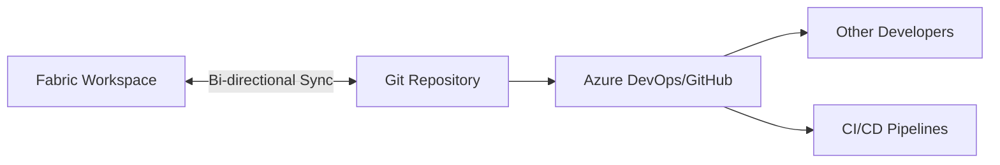

### Key Workflows You'll Practice:

| Direction | Use Case | Example |
|-----------|----------|---------|  
| **Fabric → Git** | Save your work | Edit notebook in Fabric, commit to Git |
| **Git → Fabric** | Apply team changes | Pull colleague's updates into your workspace |

## 📋 Pre-Module Checklist

> [!IMPORTANT]
> Ensure all items are checked before proceeding:

- ✅ Completed [Module 2: First Deployment](../deployment/bootstrap.md)
- ✅ Fabric portal is open in your browser
- ✅ Workspace `DEWorkshop_<username>` exists with all artifacts
- ✅ Can access Azure DevOps with workshop credentials

### Your Workspace Should Look Like This:

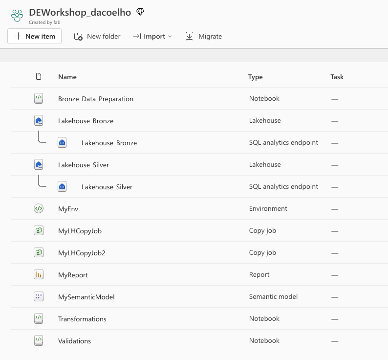

---

## 📝 Exercise 1: Setup Azure DevOps Project (5 minutes)

> **Goal:** Create your personal Azure DevOps project and initialize Git repository for the workshop.

### Step 1.1: Login to Azure DevOps

1. **Navigate to Azure DevOps:**
   - Open your browser to: `https://dev.azure.com/FabConEU`
   - Use the workshop credentials provided by your instructor

2. **Verify access:**
   - You should see the Azure DevOps dashboard
   - Click on the "FabConEU_DEWorkshop" project

> [!IMPORTANT]
> Use the exact credentials provided by your instructor for this workshop.

### Step 1.2: Fork Repository

> [!IMPORTANT]
> Use the exact username provided by your instructor for this workshop.
> This is a shared Azure DevOps project for the workshop, getting your username wrong will affect the workshop downstream and can also interfere with the work of other attendees.

1. **Navigate to Repos:**
   - Click **Repos** in the left navigation
   - Click on **Files** in the left navigation
   - You should see the files for the User000 repository by default


2. **Fork the repositoru:**
   - Click **Initialize** button in the empty repository
   - Check ☑️ **Add a README**
   - Leave ☐ **Add a .gitignore** unchecked
   - Click **Initialize**

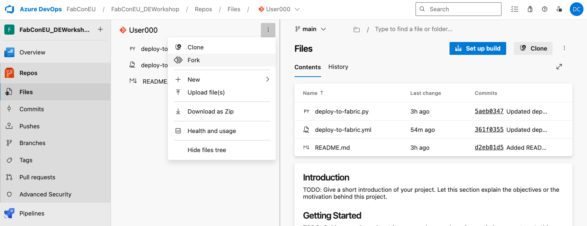

Make sure you use the correct username. Use capitalization as shown in the example.

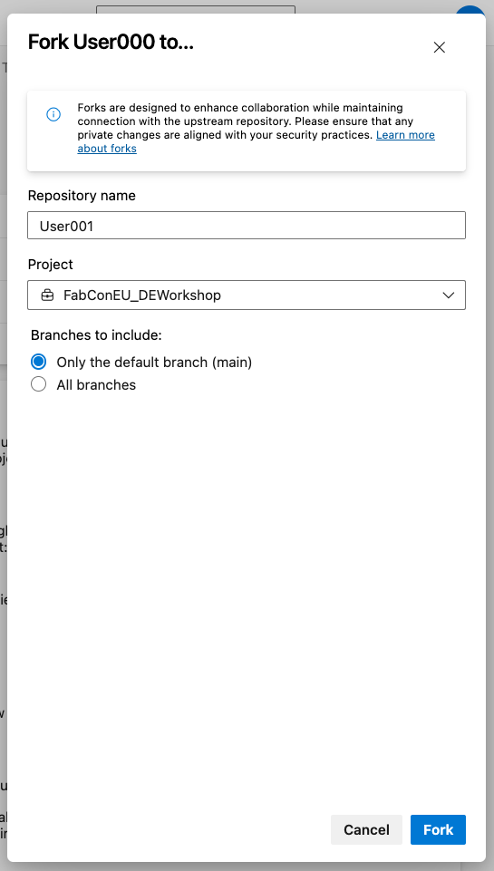

2. **Verify repository setup:**
   - You should see a `README.md`, `deploy-to-fabric.py` and `deploy-to-fabric.yml` file in the main branch of your repository.
   - The repository URL should be: `https://dev.azure.com/FabConEU/FabConEU_DEWorkshop/_git/User###`

For example, the following would be a `User209` repository fork ready to go:

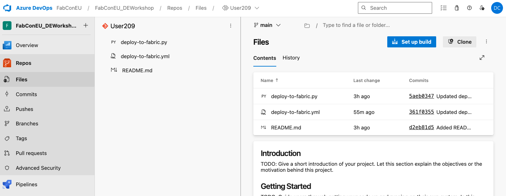

### ✅ Exercise 1 Checkpoint

**Before continuing, verify:**
- [ ] Project `DEWorkshop-<username>` created successfully
- [ ] Repository initialized with README.md file
- [ ] You can access Repos section
- [ ] Main branch is active and visible

✨ **Exercise 1 Complete!** Your Azure DevOps project is ready for Git integration.

---

## 📝 Exercise 2: Connect to Git (5 minutes)

> **Goal:** Link your Fabric workspace to your newly created Git repository.

### Step 2.1: Open Git Integration Settings

1. **In your Fabric workspace:**
   - Ensure you're in `DEWorkshop_<username>`
   - Click the **⚙️ Workspace Settings** icon (top right)

2. **Navigate to the Git integration tab:**
   - Click **Azure DevOps** 
   - Make sure your Entra Account is selected. If not add the account information.
   - Click **Connect**

### Step 2.2: Configure Repository Connection

> [!IMPORTANT]
> Use these exact settings for your personal project:

| Setting | Value | Notes |
|---------|-------|-------|
| **Git provider** | Azure DevOps | Select from dropdown |
| **Organization** | `YourOrgName` | Your workshop org |
| **Project** | `DEWorkshop-<username>` | Your personal project |
| **Repository** | `DEWorkshop-<username>` | Your git repository |
| **Branch** | `main` | Default branch |
| **Folder** | `/DE_Workshop` | Folder for your workspace |

For example, the following would be a `User209` repository configuration:

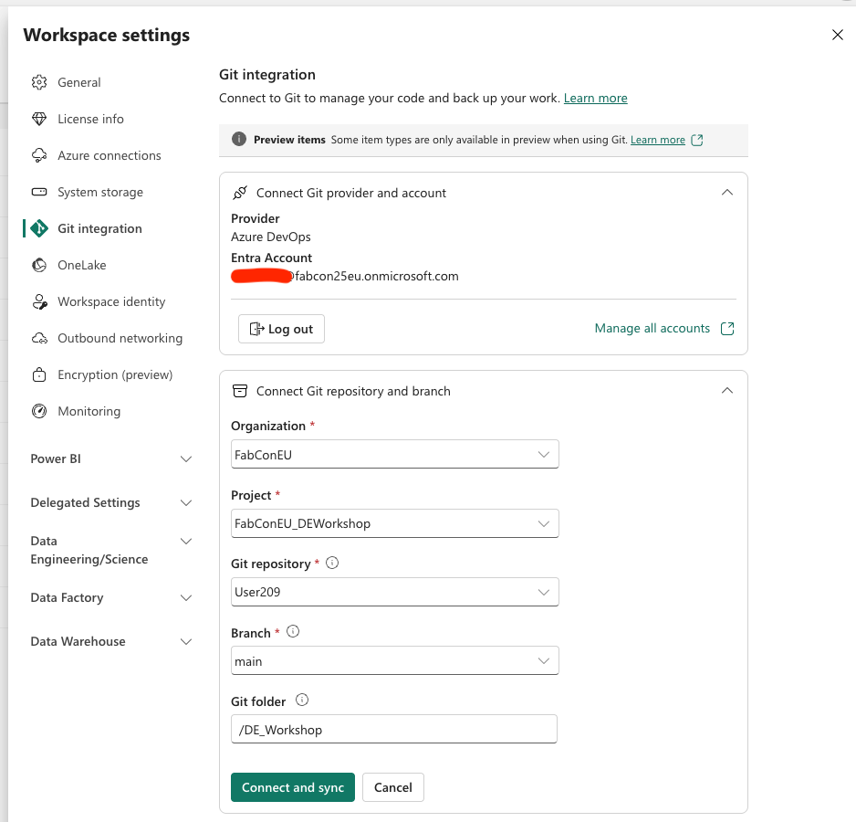

### Step 2.3: Perform Initial Sync

**Click "Connect and sync"**
    - If folder creation confirmation appears, confirm with **Create and sync**.

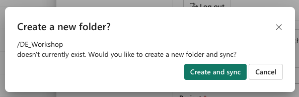

### Step 2.4: Upload one additional file to the repository

This will make life easier later in Module 7. We will upload the `parameter.yml` file that will be used in Module 7 now, so it get pushed to all branches as we go through the workshop.

#### In Azure DevOps:
1. Navigate to **Repos** → **Files** to your repository (User###)
2. Click on the icon by the `DE_Workshop` folder name like below and click ***Upload file(s)***

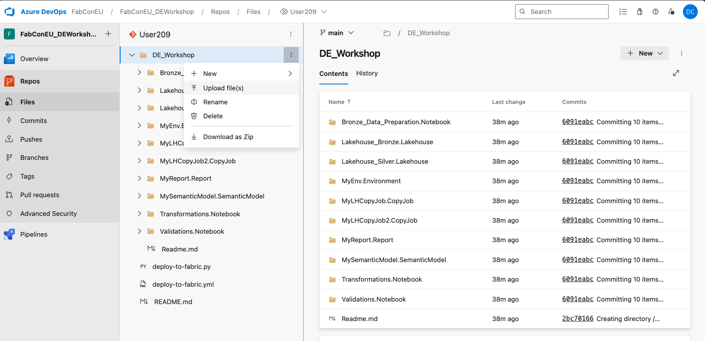

3. Select the `parameter.yml` file from your local machine and click **Commit** to upload it.

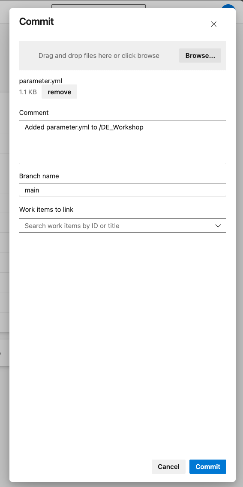

**Make sure the file `parameter.yml` is uploaded to the DE_Workshop like screenshot bellow:**

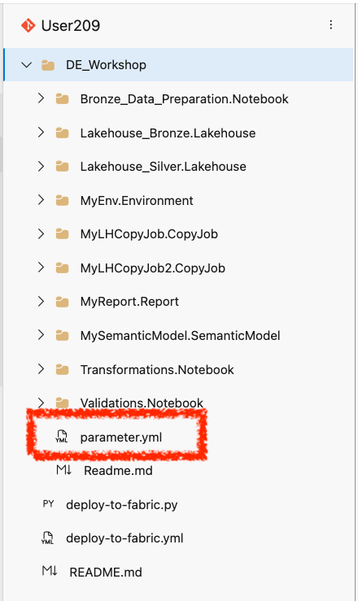

### ✅ Exercise 2 Checkpoint

**Before continuing, verify:**
- [ ] Workspace shows "Git synced" indicator
- [ ] Azure DevOps shows your workspace artifacts
- [ ] All artifacts appear in the repository

✨ **Exercise 2 Complete!** You've connected Fabric to Git.

### Step 2.4: Verify Sync Success

#### In Azure DevOps:
1. Navigate to **Repos** → **Files**
2. Verify these folders exist in your repository:

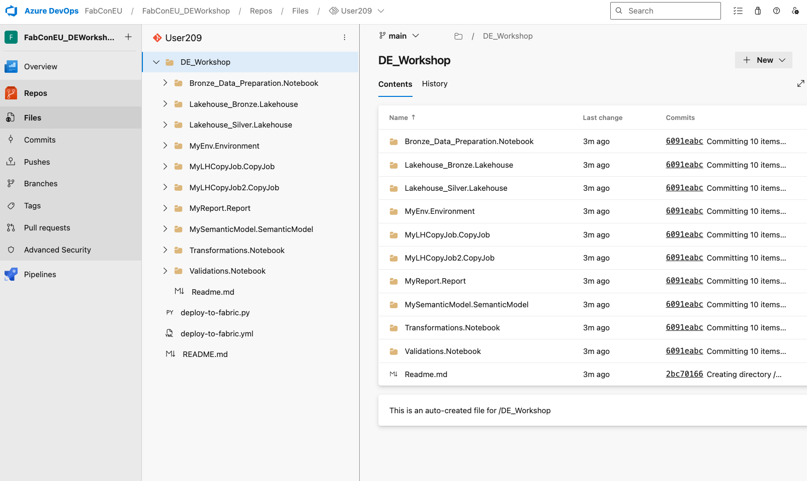

#### In Fabric:
1. Navigate to your Fabric workspace
2. Verify Synced status

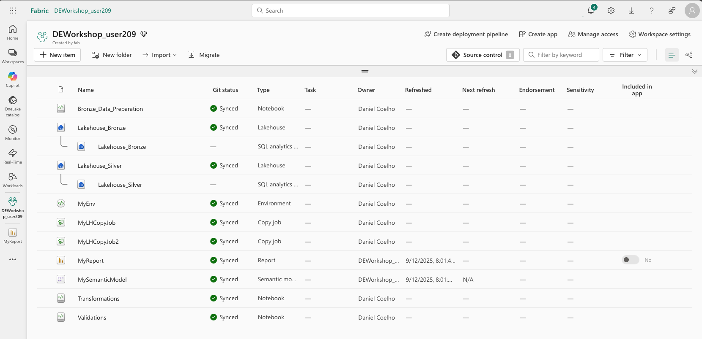

---

## 📝 Exercise 3: Fabric → Git Workflow (10 minutes)

> **Goal:** Make a change in Fabric and push it to your Git repository.
> 
> [!NOTE]
> This simulates your daily workflow of developing in Fabric and saving changes.

### Step 2.1: Modify a Lakehouse Shortcut

1. **Open Lakehouse_Silver:**
   - Click on `Lakehouse_Silver` in your workspace
   - Expand **Tables** section
   - Find the `t3` shortcut

2. **Rename the shortcut:**
   - Click **⋯** (ellipsis) next to `t3`
   - Select **Manage shortcut**
   - Change **Name** from `t3` to `t3_test`
   - Click **Check icon to save**

3. **Verify the change:**
   - Click **⋯** → **Refresh** on Tables section
   - Confirm `t3_test` appears instead of `t3`
   - Click on `t3_test` to preview data

### Step 2.2: Commit Changes to Git

1. **Open Source Control panel:**
   - Click **Source control** button in workspace header
   - You'll see pending changes:
   ```
   📝 Changes (1)
   M  Lakehouse_Silver
   ```

    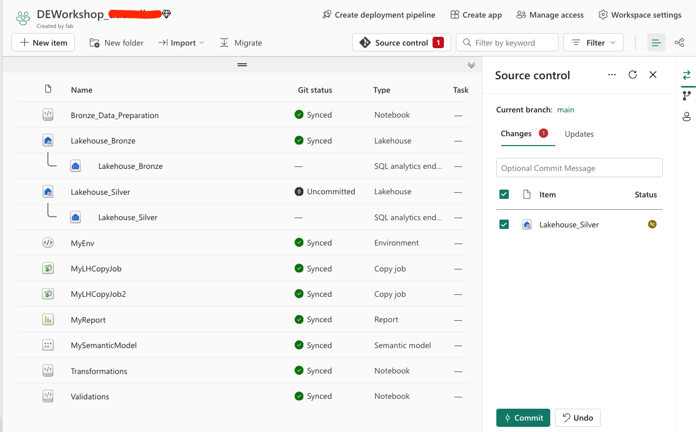

2. **Review and commit:**
   - Click **Changes** to see details
   - Add commit message:
   ```
   feat: Renamed table shortcut t3 to t3_test
   ```
   - Click **Commit**

3. **Verify in Azure DevOps:**
   - Go to **Repos** → **Commits**
   - Find your commit with timestamp
   - Click to view changed files
   - Check `shortcuts.metadata.json` shows:
   ```json
   "name": "t3_test"  // Changed from "t3"
   ```

    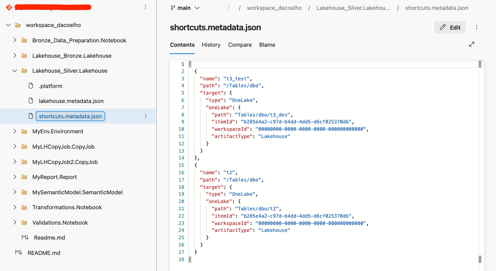

> [!WARNING]
> **Critical Concept: Dependencies**  
> When you rename database objects (tables, shortcuts), you MUST update all dependent code:  
> - Notebooks referencing the table
> - Semantic models using the table
> - Reports with direct queries
> 
> Always commit these changes together to maintain consistency!

### ✅ Exercise 3 Checkpoint

**Before continuing, verify:**
- [ ] Shortcut renamed to `t3_test` in Fabric
- [ ] Changes committed to Git with message
- [ ] Commit visible in Azure DevOps history
- [ ] `shortcuts.metadata.json` shows the new name

🎯 **Exercise 3 Complete!** You've pushed changes from Fabric to Git.

---

## 📝 Exercise 4: Git → Fabric Workflow (10 minutes)

> **Goal:** Edit files directly in Git and sync changes back to Fabric.
>
> [!NOTE]
> This simulates receiving changes from teammates or making quick fixes in Git.
> 
> **DevOps Pattern:** We'll "fix forward" rather than reverting - this maintains a clean history.

### Step 3.1: Edit in Azure DevOps

1. **Navigate to the file:**
   - In Azure DevOps, go to **Repos** → **Files**
   - Browse to:
   ```
   DE_Workshop/
   └── Lakehouse_Silver.Lakehouse/
       └── shortcuts.metadata.json
   ```

2. **Edit the file:**
   - Click **Edit** button
   - Find this line:
   ```json
   "name": "t3_test"
   ```
   - Change it back to:
   ```json
   "name": "t3"
   ```

3. **Commit the fix:**
   - Commit message:
   ```
   fix: Revert shortcut name back to t3
   ```
   - Click **Commit**

    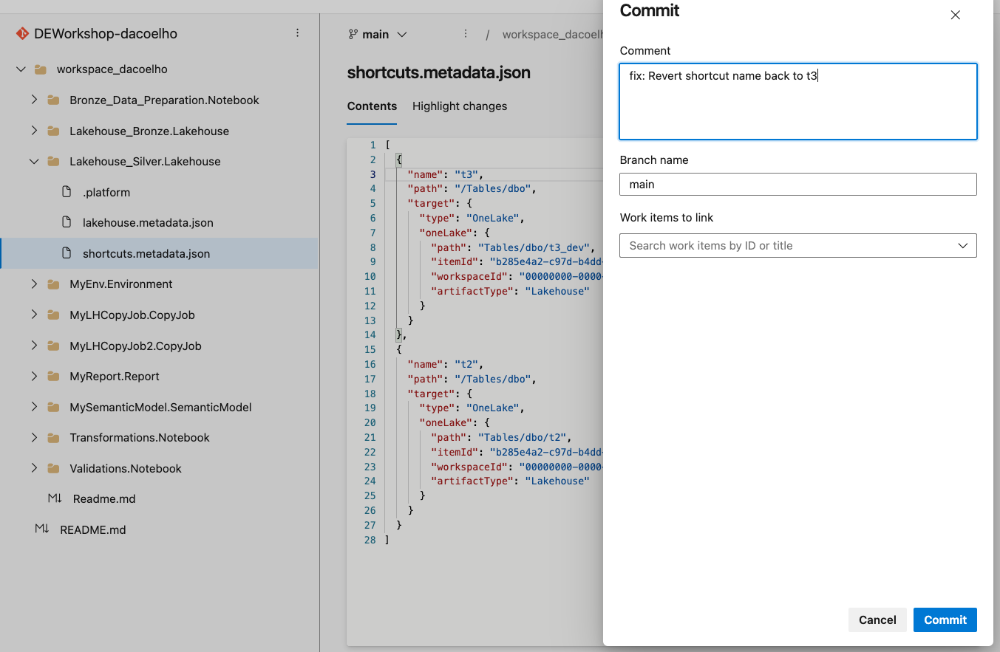

### Step 3.2: Pull Changes to Fabric

1. **Check for updates:**
   - Return to Fabric workspace
   - Notice the banner:
   ```
   ⚠️ Updates available from Git
   ```
   - Or click **Source control** to see:
   ```
   ↓ 1 incoming change
   ```

2. **Pull the changes:**
   - Click **Updates** tab
   - Review what will be updated:
   ```
   Incoming changes:
   ~ Lakehouse_Silver (modified)
   ```
   - Click **Update all**

    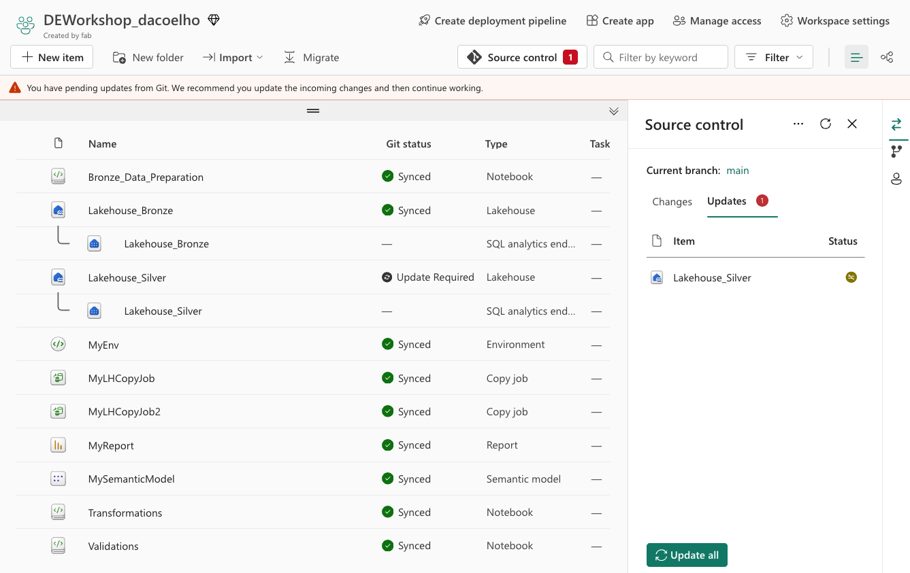

3. **Verify the fix:**
   - Open `Lakehouse_Silver`
   - Refresh Tables section
   - Confirm `t3` is back (not `t3_test`)
   - Preview data to ensure it works

> [!SUCCESS]
> You've completed a full round-trip: Fabric → Git → Fabric! 🔄

### ✅ Exercise 4 Checkpoint

**Before continuing, verify:**
- [ ] File edited in Azure DevOps and committed
- [ ] Fabric shows "Updates available" notification
- [ ] Updates pulled successfully to workspace
- [ ] Shortcut renamed back to `t3` in Lakehouse_Silver
- [ ] Data preview works correctly

🔄 **Exercise 4 Complete!** You've pulled changes from Git to Fabric.

---

## 📝 Exercise 5: Understanding What Gets Versioned (5 minutes)

> **Goal:** Learn what Fabric tracks in Git and what it doesn't.

### 📦 What's Included in Git

| Item Type | What's Versioned | What's NOT Versioned |
|-----------|------------------|---------------------|
| **Lakehouses** | • Structure & metadata<br>• Shortcut definitions<br>• Security roles | • Actual data in tables<br>• Files in OneLake |
| **Notebooks** | • All code cells<br>• Markdown content<br>• Cell metadata | • Execution results<br>• Runtime state |
| **Pipelines** | • Pipeline structure<br>• Activity definitions<br>• Parameters | • Run history<br>• Cached results |
| **Semantic Models** | • Table definitions<br>• Relationships<br>• Measures & calculations | • Imported data<br>• Refresh history |
| **Reports** | • Layout & visuals<br>• DAX queries<br>• Bookmarks | • Cached data<br>• User personalizations |
| **Connections** | • Connection metadata<br>• Endpoint URLs | • Passwords & secrets<br>• OAuth tokens |

### 🎯 Key Implications

> [!IMPORTANT]
> **The Power of Git Integration:**
> - **Multiple workspaces** can sync from the same Git branch
> - **Changes in Git** automatically flow to all connected workspaces
> - **Deployment pipelines** can promote changes across environments
> - **Code reviews** ensure quality before changes reach production

### Deployment Patterns:

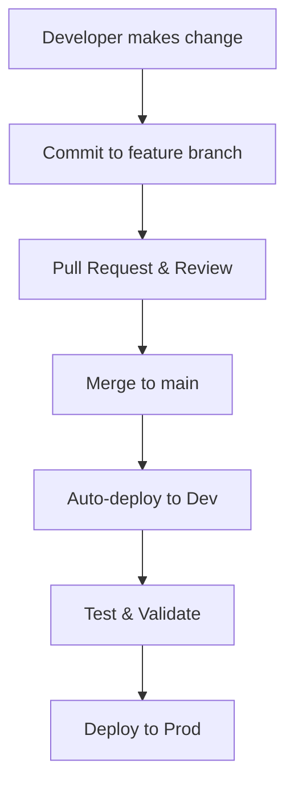

📚 **Learn more:** [Best practices for CI/CD in Microsoft Fabric](https://learn.microsoft.com/en-us/fabric/cicd/best-practices-cicd)

### ✅ Exercise 4 Checkpoint

**Review completed:**
- [ ] Understand what items sync to Git
- [ ] Know what data doesn't sync
- [ ] Grasp deployment implications
- [ ] Ready to use Git for collaboration

📚 **Exercise 5 Complete!** You understand Fabric's Git integration model.

## 🔧 Troubleshooting Guide

### Common Issues & Solutions

| Problem | Cause | Solution |
|---------|-------|----------|
| **"Updates available" won't go away** | Local changes conflict | Commit or discard local changes first |
| **"Permission denied" on commit** | No write access to repo | Ask admin for Contributor role |
| **Items missing after sync** | Wrong folder path | Check Git integration settings |
| **Sync seems stuck** | Large artifacts | Wait 2-3 minutes, then refresh |
| **Can't see Git options** | Not workspace admin | Request admin access |

### Quick Fixes:

```bash
# Check sync status
Click Source control → View status

# Force refresh
F5 or Ctrl+R in browser

# Disconnect and reconnect
Workspace settings → Git integration → Disconnect
```

## 🎉 Module Complete!

### 📊 Exercise Summary

| Exercise | Completed | What You Learned |
|----------|-----------|------------------|
| **1. Connect to Git** | ✅ | Linked workspace to Azure DevOps repository |
| **2. Branch Hierarchy** | ✅ | Created test and development branches |
| **3. Fabric → Git** | ✅ | Pushed changes from Fabric UI to version control |
| **4. Git → Fabric** | ✅ | Pulled teammate changes into your workspace |
| **5. Version Tracking** | ✅ | Understood what's tracked vs. what's not |

### ✅ Skills You've Mastered:

- 🔗 **Connected** Fabric workspace to Git repository
- ⬆️ **Pushed** changes from Fabric to Git
- ⬇️ **Pulled** changes from Git to Fabric
- 📝 **Understood** what gets versioned vs. what doesn't
- 🔄 **Practiced** the complete development loop

### 🏆 You Can Now:
- Collaborate with team members through Git
- Track all changes to your data engineering artifacts
- Review code before deploying to production
- Maintain multiple environments from one codebase

## 📚 What's Next?

> [!IMPORTANT]
> ### ✅ Module 3 Complete! Ready to Continue?
> 
> **Your Progress:** [1] ✅ → [2] ✅ → [3] ✅ → **[4]** → [5] → [6] → [7] → [8]
> 
> ### 🚀 **NEXT MODULE: Branch Management**
> 
> **📁 Location:** [`/deployment/branch-out.md`](../deployment/branch-out.md)  
> **⏱️ Duration:** 60 minutes  
> **🎯 You'll Learn:**
> - Create feature branches for isolated development
> - Deploy branches to separate workspaces
> - Test changes without affecting main
> - Merge strategies and conflict resolution
> 
> **[→ Click here to start Module 4: Branch Management](../deployment/branch-out.md)**

> [!TIP]
> **Pro Tip:** From now on, all your changes are tracked! Make meaningful commit messages - your future self will thank you. 😊

---

**Need help?** Ask your instructor or review the [Git integration documentation](https://learn.microsoft.com/fabric/cicd/git-integration/intro-to-git-integration)
