# Workshop Visual Diagrams

## 1. Workshop Flow Diagram

```mermaid
%%{init: {'theme':'base', 'themeVariables': { 'primaryColor':'#1e88e5', 'primaryTextColor':'#fff', 'primaryBorderColor':'#0d47a1', 'lineColor':'#42a5f5', 'secondaryColor':'#ffa726', 'tertiaryColor':'#66bb6a', 'background':'#ffffff', 'mainBkg':'#e3f2fd', 'secondBkg':'#fff3e0', 'tertiaryBkg':'#e8f5e9'}}}%%
graph TB
    Start([<b>WORKSHOP START</b><br/>9:00 AM]):::startClass
    End([<b>WORKSHOP COMPLETE</b><br/>4:30 PM<br/>Q&A Session]):::endClass
    
    %% Morning Sessions
    M1[<b>Module 1: Environment Setup</b><br/>━━━━━━━━━━━━━━━<br/>• Install Tools<br/>• Configure Workspace<br/>• Connect to Git<br/><i>30 minutes</i>]:::beginnerClass
    
    M2[<b>Module 2: First Deployment</b><br/>━━━━━━━━━━━━━━━<br/>• Deploy Medallion Architecture<br/>• Verify Power BI Reports<br/>• Initial Data Pipeline<br/><i>30 minutes</i>]:::beginnerClass
    
    M3[<b>Module 3: Version Control</b><br/>━━━━━━━━━━━━━━━<br/>• Git Integration<br/>• Commit & Sync<br/>• Conflict Resolution<br/><i>30 minutes</i>]:::beginnerClass
    
    %% Advanced Sessions
    M4[<b>Module 4: Branch Management</b><br/>━━━━━━━━━━━━━━━<br/>• Feature Branches<br/>• Isolated Workspaces<br/>• Merge Strategies<br/><i>60 minutes</i>]:::intermediateClass
    
    M5[<b>Module 5: Deployment Pipelines</b><br/>━━━━━━━━━━━━━━━<br/>• Configure Stages<br/>• Variable Libraries<br/>• Deployment Rules<br/><i>60 minutes</i>]:::intermediateClass
    
    %% Afternoon Sessions
    M6[<b>Module 6: End-to-End Pipeline</b><br/>━━━━━━━━━━━━━━━<br/>• Dev → Test → Prod<br/>• Environment Validation<br/>• Troubleshooting<br/><i>45 minutes</i>]:::advancedClass
    
    M7[<b>Module 7: Azure DevOps</b><br/>━━━━━━━━━━━━━━━<br/>• CI/CD Automation<br/>• Service Principals<br/>• YAML Pipelines<br/><i>30 minutes</i>]:::advancedClass
    
    M8[<b>Module 8: Schema Evolution</b><br/>━━━━━━━━━━━━━━━<br/>• Data Migration<br/>• Safe Schema Changes<br/>• Rollback Strategies<br/><i>45 minutes</i>]:::advancedClass
    
    %% Checkpoints
    CP1{<b>🎯 CHECKPOINT #1</b><br/>Foundation Ready<br/>Instructor Review}:::checkpointClass
    CP2{<b>🎯 CHECKPOINT #2</b><br/>Pipeline Working<br/>Instructor Review}:::checkpointClass
    CP3{<b>🎯 CHECKPOINT #3</b><br/>Automation Ready<br/>Instructor Review}:::checkpointClass
    
    %% Breaks
    Break1[<b>Morning Break</b><br/>10:30 - 11:00]:::breakClass
    Lunch[<b>Lunch Break</b><br/>1:00 - 2:00 PM]:::breakClass
    Break2[<b>Afternoon Break</b><br/>3:15 - 3:45]:::breakClass
    
    %% Flow
    Start --> M1
    M1 --> M2
    M2 --> CP1
    CP1 --> M3
    M3 --> Break1
    Break1 --> M4
    M4 --> M5
    M5 --> CP2
    CP2 --> Lunch
    Lunch --> M6
    M6 --> M7
    M7 --> CP3
    CP3 --> Break2
    Break2 --> M8
    M8 --> End
    
    %% Styling
    classDef startClass fill:#2e7d32,stroke:#1b5e20,stroke-width:3px,color:#fff,font-weight:bold
    classDef endClass fill:#1565c0,stroke:#0d47a1,stroke-width:3px,color:#fff,font-weight:bold
    classDef beginnerClass fill:#e8f5e9,stroke:#4caf50,stroke-width:2px,color:#1b5e20
    classDef intermediateClass fill:#fff3e0,stroke:#ff9800,stroke-width:2px,color:#e65100
    classDef advancedClass fill:#fce4ec,stroke:#e91e63,stroke-width:2px,color:#880e4f
    classDef checkpointClass fill:#ffd54f,stroke:#f57c00,stroke-width:3px,color:#000,font-weight:bold
    classDef breakClass fill:#f5f5f5,stroke:#9e9e9e,stroke-width:1px,color:#424242,font-style:italic
```



## 2. Workshop Purpose & Architecture Diagram

```mermaid
%%{init: {'theme':'base', 'themeVariables': { 'primaryColor':'#6366f1', 'primaryTextColor':'#fff', 'fontFamily': 'Arial', 'fontSize': '16px'}}}%%
graph LR
    subgraph transformation["<b>YOUR TRANSFORMATION JOURNEY</b>"]
        direction LR
        
        subgraph current["<b>CURRENT STATE</b>"]
            Manual["<b>Manual Development</b><br/>━━━━━━━━━━━<br/>❌ UI-based changes<br/>❌ No version control<br/>❌ Manual deployments<br/>❌ Error-prone<br/>❌ Slow iteration"]:::manualClass
        end
        
        subgraph learning["<b>WORKSHOP LEARNING</b>"]
            Learn["<b>Skills You Gain</b><br/>━━━━━━━━━━━<br/>✓ Git integration<br/>✓ Branch strategies<br/>✓ Pipeline automation<br/>✓ Schema evolution<br/>✓ CI/CD patterns"]:::learnClass
        end
        
        subgraph future["<b>FUTURE STATE</b>"]
            Auto["<b>Automated CI/CD</b><br/>━━━━━━━━━━━<br/>✓ Git-controlled<br/>✓ Multi-environment<br/>✓ Automated testing<br/>✓ Safe deployments<br/>✓ Fast iteration"]:::autoClass
        end
        
        Manual ==>|"<b>8-Hour Workshop</b>"| Learn
        Learn ==>|"<b>Implement</b>"| Auto
    end
    
    subgraph architecture["<b>TECHNICAL ARCHITECTURE YOU BUILD</b>"]
        direction TB
        
        subgraph env["<b>3-Stage Pipeline</b>"]
            Dev["<b>Development</b><br/>Feature Branches<br/>Isolated Testing"]:::devClass
            Test["<b>Test</b><br/>Integration Testing<br/>UAT Validation"]:::testClass
            Prod["<b>Production</b><br/>Live System<br/>Business Users"]:::prodClass
            
            Dev -->|"Promote"| Test
            Test -->|"Approve & Deploy"| Prod
        end
        
        subgraph data["<b>Medallion Architecture</b>"]
            Bronze["<b>Bronze Layer</b><br/>Raw Data<br/>Source Format"]:::bronzeClass
            Silver["<b>Silver Layer</b><br/>Cleansed Data<br/>Business Logic"]:::silverClass
            Gold["<b>Gold Layer</b><br/>Analytics Ready<br/>Aggregated"]:::goldClass
            
            Bronze -->|"Transform"| Silver
            Silver -->|"Aggregate"| Gold
        end
        
        subgraph tools["<b>Automation Stack</b>"]
            Git["<b>Git Repository</b><br/>Version Control<br/>Collaboration"]:::gitClass
            Pipeline["<b>Fabric Pipeline</b><br/>Deployment Rules<br/>Variables"]:::pipelineClass
            Azure["<b>Azure DevOps</b><br/>CI/CD Automation<br/>Service Principals"]:::azureClass
            
            Git -->|"Trigger"| Pipeline
            Pipeline -->|"Orchestrate"| Azure
        end
    end
    
    transformation -.->|"<b>Enables</b>"| architecture
    
    classDef manualClass fill:#ffebee,stroke:#c62828,stroke-width:2px,color:#b71c1c,font-weight:bold
    classDef learnClass fill:#e3f2fd,stroke:#1565c0,stroke-width:2px,color:#0d47a1,font-weight:bold
    classDef autoClass fill:#e8f5e9,stroke:#2e7d32,stroke-width:2px,color:#1b5e20,font-weight:bold
    classDef devClass fill:#f3e5f5,stroke:#6a1b9a,stroke-width:2px,color:#4a148c
    classDef testClass fill:#fff3e0,stroke:#ef6c00,stroke-width:2px,color:#e65100
    classDef prodClass fill:#ffebee,stroke:#c62828,stroke-width:2px,color:#b71c1c
    classDef bronzeClass fill:#efebe9,stroke:#5d4037,stroke-width:2px,color:#3e2723
    classDef silverClass fill:#f5f5f5,stroke:#616161,stroke-width:2px,color:#212121
    classDef goldClass fill:#fffde7,stroke:#f9a825,stroke-width:2px,color:#f57f17
    classDef gitClass fill:#fce4ec,stroke:#c2185b,stroke-width:2px,color:#880e4f
    classDef pipelineClass fill:#e8eaf6,stroke:#3949ab,stroke-width:2px,color:#1a237e
    classDef azureClass fill:#e1f5fe,stroke:#0277bd,stroke-width:2px,color:#01579b
```



## 3. Skills Progression Map

```mermaid
%%{init: {'theme':'base', 'themeVariables': { 'primaryColor':'#4caf50', 'primaryTextColor':'#fff'}}}%%
graph TD
    Start([<b>START YOUR JOURNEY</b>]):::startNode
    Complete([<b>WORKSHOP COMPLETE</b><br/>Ready for Production]):::completeNode
    
    subgraph beginner["<b>🟢 BEGINNER LEVEL</b> (Modules 1-3)"]
        B1[<b>1. Install Tools</b><br/>fabric-cli setup<br/>Python environment]:::beginnerNode
        B2[<b>2. Create Workspace</b><br/>Fabric portal<br/>Capacity assignment]:::beginnerNode
        B3[<b>3. Deploy Items</b><br/>Lakehouses<br/>Notebooks<br/>Reports]:::beginnerNode
        B4[<b>4. Basic Git Sync</b><br/>Connect repository<br/>Commit changes]:::beginnerNode
        
        B1 --> B2
        B2 --> B3
        B3 --> B4
    end
    
    subgraph intermediate["<b>🟡 INTERMEDIATE LEVEL</b> (Modules 4-5)"]
        I1[<b>5. Branch Management</b><br/>Feature branches<br/>Merge strategies]:::intermediateNode
        I2[<b>6. Multiple Workspaces</b><br/>Environment isolation<br/>Workspace-branch mapping]:::intermediateNode
        I3[<b>7. Deployment Pipelines</b><br/>Stage configuration<br/>Promotion flows]:::intermediateNode
        I4[<b>8. Environment Variables</b><br/>Variable libraries<br/>Environment configs]:::intermediateNode
        
        I1 --> I2
        I2 --> I3
        I3 --> I4
    end
    
    subgraph advanced["<b>🔴 ADVANCED LEVEL</b> (Modules 6-8)"]
        A1[<b>9. Three-Stage Pipelines</b><br/>Dev-Test-Prod flow<br/>Approval gates]:::advancedNode
        A2[<b>10. Azure DevOps CI/CD</b><br/>YAML pipelines<br/>Automated triggers]:::advancedNode
        A3[<b>11. Service Principals</b><br/>Security setup<br/>API permissions]:::advancedNode
        A4[<b>12. Schema Evolution</b><br/>Safe migrations<br/>Backward compatibility]:::advancedNode
        A5[<b>13. Data Migration</b><br/>Zero-downtime changes<br/>Rollback procedures]:::advancedNode
        
        A1 --> A2
        A2 --> A3
        A3 --> A4
        A4 --> A5
    end
    
    Start --> B1
    B4 --> I1
    I4 --> A1
    A5 --> Complete
    
    classDef startNode fill:#2e7d32,stroke:#1b5e20,stroke-width:3px,color:#fff,font-weight:bold
    classDef completeNode fill:#1565c0,stroke:#0d47a1,stroke-width:3px,color:#fff,font-weight:bold
    classDef beginnerNode fill:#c8e6c9,stroke:#4caf50,stroke-width:2px,color:#1b5e20,font-weight:bold
    classDef intermediateNode fill:#fff9c4,stroke:#ffc107,stroke-width:2px,color:#f57c00,font-weight:bold
    classDef advancedNode fill:#ffcdd2,stroke:#f44336,stroke-width:2px,color:#b71c1c,font-weight:bold
    
    style beginner fill:#f1f8e9,stroke:#689f38,stroke-width:3px
    style intermediate fill:#fffde7,stroke:#ffa000,stroke-width:3px
    style advanced fill:#fce4ec,stroke:#c2185b,stroke-width:3px
```



## 4. Value Proposition Diagram


## 5. Before vs After Transformation


## 6. Workshop Decision Flow (For Participants)

```mermaid
%%{init: {'theme':'base', 'themeVariables': { 'primaryColor':'#673ab7', 'primaryTextColor':'#fff'}}}%%
flowchart TD
    Start{<b>Are you using<br/>Microsoft Fabric?</b>}:::questionNode
    
    Start -->|"<b>YES</b>"| Q2{<b>Do you want<br/>automated deployments?</b>}:::questionNode
    Start -->|"<b>NO</b>"| NotForYou[<b>Not Yet Ready</b><br/>━━━━━━━━━<br/>Come back when<br/>you adopt Fabric]:::notReadyNode
    
    Q2 -->|"<b>YES</b>"| Q3{<b>Is your team<br/>growing?</b>}:::questionNode
    Q2 -->|"<b>NO</b>"| Manual[<b>Manual is OK</b><br/>━━━━━━━━━<br/>For now...<br/>Revisit later]:::maybeNode
    
    Q3 -->|"<b>YES</b>"| Perfect[<b>PERFECT FIT!</b><br/>━━━━━━━━━<br/>This workshop is<br/>designed for you]:::perfectNode
    Q3 -->|"<b>NO</b>"| Q4{<b>Want to reduce<br/>deployment errors?</b>}:::questionNode
    
    Q4 -->|"<b>YES</b>"| Perfect
    Q4 -->|"<b>NO</b>"| Q5{<b>Spending too much<br/>time on deployments?</b>}:::questionNode
    
    Q5 -->|"<b>YES</b>"| Perfect
    Q5 -->|"<b>NO</b>"| Consider[<b>Consider for Future</b><br/>━━━━━━━━━<br/>Bookmark for when<br/>pain points arise]:::maybeNode
    
    Perfect --> Benefits[<b>YOU WILL GAIN</b><br/>━━━━━━━━━━━<br/>✓ CI/CD automation<br/>✓ Safe deployments<br/>✓ Team collaboration<br/>✓ Fast iteration<br/>✓ Version control<br/>✓ Rollback capability<br/>✓ Multi-environment<br/>✓ Production confidence]:::benefitsNode
    
    Benefits --> Register[<b>REGISTER NOW</b><br/>━━━━━━━━━<br/>8 hours investment<br/>Lifetime of benefits]:::registerNode
    
    classDef questionNode fill:#e1bee7,stroke:#7b1fa2,stroke-width:2px,color:#4a148c,font-weight:bold
    classDef perfectNode fill:#a5d6a7,stroke:#2e7d32,stroke-width:3px,color:#1b5e20,font-weight:bold
    classDef benefitsNode fill:#e8f5e9,stroke:#388e3c,stroke-width:2px,color:#1b5e20
    classDef notReadyNode fill:#ffcdd2,stroke:#d32f2f,stroke-width:2px,color:#b71c1c,font-weight:bold
    classDef maybeNode fill:#fff9c4,stroke:#f9a825,stroke-width:2px,color:#f57f17
    classDef registerNode fill:#1976d2,stroke:#0d47a1,stroke-width:3px,color:#fff,font-weight:bold
```



## How to Use These Diagrams

### In README.md
Add this section near the top of your README:

```markdown
## 📊 Visual Overview

Want to understand the workshop at a glance? Check our [visual diagrams](./workshop-diagrams.md):
- 🗺️ Complete workshop flow with checkpoints
- 🎯 Purpose and transformation journey  
- 📈 Skills progression path
- 💡 Business value proposition
```

### For Presentations
1. **Opening Slide**: Use the "Purpose & Architecture" diagram to set expectations
2. **Agenda**: Use the "Workshop Flow" diagram to show the day's journey
3. **Value Prop**: Use the "Before vs After" to motivate participants
4. **Closing**: Use the "Skills Progression" to show what they've achieved

### For Participants
- Print the "Workshop Flow" diagram as a reference sheet
- Use checkpoints to track progress
- Refer to "Decision Flow" if questioning relevance

### For Instructors
- Use flow diagram to manage time
- Reference checkpoint locations
- Show progression map to encourage struggling participants